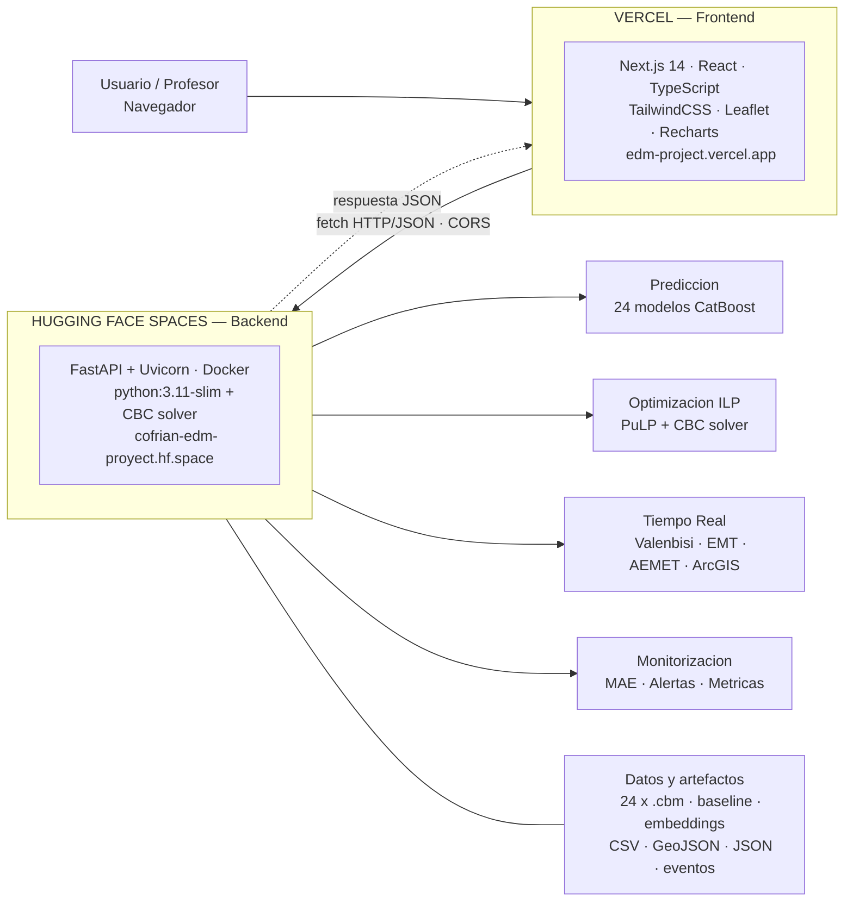

# UrbanFlow Valencia

> **Herramienta de planificación y optimización urbana para operarios del Ayuntamiento de Valencia**
> Proyecto de la asignatura **EDM — Evaluación, Despliegue y Monitorización de Modelos**
> Grado en Ciencia de Datos · Universitat Politècnica de València (UPV)

| | URL |
|---|---|
| **Demo web** | https://edm-project.vercel.app |
| **API REST** | https://cofrian-edm-proyect.hf.space |
| **Documentación API (Swagger)** | https://cofrian-edm-proyect.hf.space/docs |
| **Estado de la API** | https://cofrian-edm-proyect.hf.space/health |
| **Repositorio GitHub** | https://github.com/cofrian/edm_project |

---

## ¿Qué es UrbanFlow Valencia?

UrbanFlow Valencia es una **herramienta de apoyo a la decisión para operarios del Ayuntamiento de Valencia** con dos módulos independientes:

**Módulo A — Predicción de tráfico**
Veinticuatro modelos CatBoost (uno por hora del día, de 0 a 23) predicen la intensidad de tráfico en las 1.158 zonas de la ciudad. El operario puede consultar cualquier combinación de zona, hora y día para conocer el nivel de tráfico esperado con su margen de fiabilidad. Útil para planificar operaciones viarias, dispositivos de seguridad o eventos urbanos.

**Módulo B — Optimización de instalaciones**
Un solver de programación lineal entera (PuLP + CBC) selecciona las ubicaciones de polideportivos, centros de salud o estaciones Valenbisi que maximizan la cobertura de población bajo una restricción de presupuesto real. Opera de forma independiente al módulo de predicción: sus entradas son candidatos reales del Ayuntamiento y datos censales H3.

**Monitorización del modelo en producción**
El módulo de monitorización calcula el MAE por hora, lanza alertas cuando supera el umbral configurado y señala las zonas con error sistemático. Permite al equipo técnico detectar degradación del modelo sin intervención manual.

Además, la aplicación integra datos en tiempo real de Valenbisi, autobuses EMT, estado del tráfico del Ayuntamiento y meteorología (AEMET / Open-Meteo).

---

## Contexto académico — EDM y CRISP-DM

La asignatura EDM cubre el ciclo completo de vida de un modelo de machine learning desde el dato crudo hasta el sistema monitorizado en producción. El proyecto aplica el estándar **CRISP-DM** en todas sus fases, con especial énfasis en las que habitualmente se omiten en proyectos académicos: despliegue, automatización y monitorización.

| Fase CRISP-DM | Implementación en UrbanFlow Valencia |
|---|---|
| **Comprensión del negocio** | Herramienta para operarios del Ayuntamiento: predecir tráfico horario en 1.158 zonas y optimizar ubicación de equipamientos bajo presupuesto |
| **Comprensión de los datos** | Datos del Ayuntamiento: tráfico octubre 2023, Valenbisi, EMT, AEMET, eventos urbanos |
| **Preparación de los datos** | Limpieza, alineación temporal, embeddings de zona (5 dimensiones), features cíclicas |
| **Modelado** | 24 modelos CatBoost por hora + baseline histórico + shrink weight sigmoid |
| **Evaluación** | Validación temporal (días 25-31), MAE/RMSE/R²/sMAPE, análisis por zona y hora |
| **Despliegue** | FastAPI en Hugging Face + Next.js en Vercel + CI/CD con GitHub Actions |
| **Monitorización** | Alertas de MAE por hora, zonas de baja fiabilidad, métricas del sistema en tiempo real |

El énfasis diferencial de EDM está en que el modelo no termina con la evaluación: debe desplegarse como servicio, automatizarse su publicación y observarse su comportamiento en producción. UrbanFlow Valencia implementa este ciclo completo.

---

## Arquitectura del sistema



> **Punto clave:** Vercel solo sirve HTML, CSS y JavaScript. Toda la lógica de negocio (modelos, optimización, datos en tiempo real) vive en el backend de Hugging Face. Las llamadas HTTP salen desde el navegador del usuario hacia Hugging Face mediante CORS, no desde Vercel.

---

## Módulos funcionales

```mermaid
flowchart TD
    subgraph FUENTES["1 · Fuentes de datos"]
        F1["Historicos — Trafico Valencia oct2023 · Baseline · Metricas validacion"]
        F2["Espaciales — Zonas GeoJSON · Hexagonos H3 · Candidatos · Valenbisi · EMT"]
        F3["Tiempo real — Valenbisi ArcGIS · EMT Valencia · ArcGIS Trafico · AEMET / Open-Meteo"]
        F4["Eventos urbanos — Conciertos · Partidos · Ferias · Actividades"]
    end

    subgraph BACKEND["2 · Motor backend · FastAPI"]
        B1["Prediccion de trafico — 24 modelos CatBoost por hora · Features temporales y meteo"]
        B2["Optimizacion urbana — PuLP + CBC solver · Deportes · Salud · Multi · Valenbisi"]
        B3["Integracion de movilidad — Cache TTL · Normalizacion · Fallback meteorologico"]
        B4["Monitorizacion — MAE · RMSE · R2 · sMAPE · Alertas fiabilidad · Zonas a revisar"]
    end

    subgraph API["3 · API REST"]
        A1["/predict  /predict/heatmap  /predict/hour"]
        A2["/optimize/sports  /optimize/health  /optimize/multi  /optimize/valenbisi"]
        A3["/mobility/valenbisi  /mobility/emt/stops  /mobility/alerts"]
        A4["/map/zones  /metrics/by-hour  /monitoring/alerts  /weather/forecast"]
    end

    subgraph FRONTEND["4 · Frontend · Next.js"]
        W1["Prediccion — Heatmap de trafico por hora y zona"]
        W2["Optimizacion — Escenarios de instalaciones con mapa de cobertura"]
        W3["Evaluacion — Metricas del modelo y comparativas"]
        W4["Monitorizacion — Alertas de fiabilidad y estado del sistema"]
        W5["Datos / Metodologia — Fuentes y documentacion CRISP-DM"]
    end

    FUENTES --> BACKEND --> API --> FRONTEND
```



---

## Módulo 1 — Predicción de tráfico (CatBoost)

**Algoritmo:** 24 modelos CatBoost independientes, uno por hora del día (hora 0 a hora 23).

**Datos de entrenamiento:** Tráfico de Valencia, octubre de 2023. Validación temporal: días 1-24 para entrenamiento, días 25-31 para prueba (nunca vistos durante el ajuste).

**Features del modelo:**

| Categoría | Variables |
|---|---|
| Temporales (cíclicas) | `hora_sin`, `hora_cos`, `dia_mes_norm`, `wind_sin`, `wind_cos` |
| Zona | Embeddings de 5 dimensiones por zona (`z_emb1`...`z_emb5`) |
| Meteorológicas | `temp_c`, `hum_rel`, `pres_mb`, `vel_viento_ms`, `precip_lm2` |
| Retardos | `temp_c_lag1`, `temp_c_lag3`, `pres_mb_lag1`, `pres_mb_lag3` |
| Categoriales | `Zona`, `Dia_Semana`, `tipo_dia` |

**Fórmula de predicción (enfoque híbrido):**

```
intensidad = baseline(zona, dia_semana, hora) × exp(shrink_weight × residual_CatBoost)
shrink_weight = sigmoid((baseline − τ) / s)
```

El peso sigmoid hace que la predicción regrese hacia el baseline histórico cuando la incertidumbre es alta (zonas con poco tráfico o horas nocturnas), evitando predicciones erróneas en condiciones poco representadas en el entrenamiento.

**Resultados sobre datos de prueba (días 25-31, nunca usados en entrenamiento):**

| MAE | RMSE | R² | sMAPE |
|---|---|---|---|
| 44,4 veh/h | 87,8 | 0,92 | 16,8 % |

---

## Módulo 2 — Optimización urbana (ILP)

Programación Lineal Entera implementada con **PuLP** y el solver de código abierto **CBC (COIN-OR)**.

**Problema general:**
```
Maximizar:   Σⱼ población_j × Yⱼ       (cobertura poblacional)
Sujeto a:    Yⱼ ≤ Σᵢ αᵢⱼ × Xᵢ         (cobertura según candidatos seleccionados)
             Σᵢ coste_i × Xᵢ ≤ presupuesto
             Xᵢ, Yⱼ ∈ {0, 1}
```

Donde `αᵢⱼ` es 1 si el candidato `i` cubre el hexágono H3 de población `j`.

| Endpoint | Objetivo | Restricción |
|---|---|---|
| `POST /optimize/sports` | Máx. población con cobertura deportiva | Presupuesto total |
| `POST /optimize/health` | Máx. población con cobertura sanitaria | Presupuesto total |
| `POST /optimize/multi` | Equilibrio deporte + salud (parámetro λ) | Presupuesto + sin solapamiento |
| `POST /optimize/valenbisi` | Máx. tráfico + población + déficit | N estaciones fijas |
| `POST /optimize/coverage` | Máx. cobertura poblacional general | Presupuesto total |

Tiempo de resolución típico: **5 a 30 segundos**.

---

## Módulo 3 — Integración de movilidad en tiempo real

| Fuente | Datos | Cache TTL |
|---|---|---|
| **AEMET** (`opendata.aemet.es`) | Temperatura, humedad, presión, viento, precipitación | 600 s |
| **Open-Meteo** | Fallback meteorológico gratuito si AEMET no responde | 600 s |
| **Valenbisi** (ArcGIS Ayuntamiento) | Bicicletas y anclajes disponibles por estación | 180 s |
| **EMT Valencia** (SAE + GTFS) | Paradas, llegadas en tiempo real, rutas de autobús | 45 s |
| **ArcGIS Ayuntamiento** | Estado del tráfico: fluido / denso / congestionado / cortado | 60 s |

**Cadena de fallback meteorológico:** AEMET → Open-Meteo → valores sinusoidales estimados por hora del día.

**Alertas inteligentes generadas automáticamente:**
- Estación Valenbisi vacía, llena o cerrada
- Estación Valenbisi próxima a un evento activo (radio < 1 km)
- Autobús EMT con retraso superior a 3 minutos
- Posición estimada del bus calculada por ruta y tiempo restante cuando el SAE no responde

---

## Módulo 4 — Monitorización del modelo

El sistema compara el MAE de cada hora frente a un umbral configurable (por defecto 80 veh/h).

- Si una hora supera el umbral → alerta de baja fiabilidad para esa franja horaria
- Se identifican las zonas con mayor error sistemático en validación
- Se expone el estado del sistema: CPU, memoria y uptime del contenedor Docker

**Endpoints:** `GET /monitoring/alerts` · `GET /monitoring/zones-to-review` · `GET /monitoring/system`

---

## Frontend — Páginas de la aplicación

| Ruta | Descripción |
|---|---|
| `/` | Presentación del proyecto y acceso a módulos |
| `/datos` | Dataset, variables y proceso de preparación de datos |
| `/prediccion` | Heatmap de tráfico por hora + movilidad en tiempo real |
| `/evaluacion` | MAE, RMSE, R², sMAPE; errores por hora y zona; gráfico real vs predicho |
| `/optimizacion` | Escenarios de instalación con mapa de resultados y cobertura poblacional |
| `/monitorizacion` | Alertas de fiabilidad, zonas de riesgo y estado del sistema |
| `/metodologia` | Metodología, CRISP-DM, fuentes de datos y documentación técnica |

---

## CI/CD — Integración y despliegue continuos

```mermaid
flowchart TD
    DEV["Developer local"] -->|git push| GH["GitHub\ncofrian/edm_project"]

    subgraph GITFLOW["GitFlow"]
        d[develop] -->|PR aprobado| m[main]
        m -->|PR aprobado| p[production]
    end

    GH -.->|rama activa| GITFLOW

    GH -->|"Push o PR backend/"| CI_BE["backend-ci.yml
    Ruff lint + pytest + FastAPI import"]
    GH -->|"Push o PR frontend/"| CI_FE["frontend-ci.yml
    ESLint + TypeScript + next build"]
    GH -->|"Push a main backend/"| CI_DK["docker-build.yml
    docker build solo valida"]

    GH -->|"Push a production backend/"| DH1

    subgraph DHF["deploy-hf.yml"]
        DH1["1 Validate Ruff + pytest"] --> DH2["2 Clone HF Space con HF_TOKEN"]
        DH2 --> DH3["3 rsync backend a hf-space"]
        DH3 --> DH4["4 git commit + git push HF"]
        DH4 --> DH5["5 curl /health hasta 6 min"]
    end

    DH4 -->|"HF detecta push y reconstruye Docker"| HF1

    subgraph HFSPACE["Hugging Face Space — cofrian/edm_proyect"]
        HF1["Dockerfile python:3.11-slim + CBC"] --> HF2["FastAPI + uvicorn puerto 7860"]
        HF2 --> HF_URL["API en vivo
        cofrian-edm-proyect.hf.space"]
    end

    GH -->|"Push a production frontend/"| V1

    subgraph VERCEL["Vercel"]
        V1["Detecta cambios en frontend/"] --> V2["npm run build Next.js 14"]
        V2 --> V_URL["Frontend en vivo
        edm-project.vercel.app"]
    end

    V_URL -->|"NEXT_PUBLIC_API_URL"| HF_URL
    DH5 -.->|"Deploy OK"| DONE(["Completado"])
```



### Workflows de GitHub Actions

| Workflow | Cuándo se ejecuta | Qué hace |
|---|---|---|
| `backend-ci.yml` | Push o PR con cambios en `backend/` | Ruff lint · pytest 13 tests · FastAPI import check |
| `frontend-ci.yml` | Push o PR con cambios en `frontend/` | ESLint · TypeScript · next build |
| `docker-build.yml` | Push a `main` con cambios en `backend/` | Docker build (solo valida el empaquetado, no despliega) |
| `deploy-hf.yml` | Push a `production` con cambios en `backend/` | Validate → rsync → push HF → health check |
| `deploy-check.yml` | Push a `production` | `curl /health` para confirmar que la API responde |

### Flujo de despliegue del backend (deploy-hf.yml)

1. Push a `production` con cambios en `backend/`
2. **Validación:** Ruff + pytest. Si falla, el despliegue se detiene aquí.
3. **Sincronización:** clona el Space `cofrian/edm_proyect` con `HF_TOKEN`, copia `backend/` con `rsync` (excluyendo `.git`, `.env`, `__pycache__`) y hace `git push` al repositorio de HF.
4. **Reconstrucción:** Hugging Face detecta el push y reconstruye el Docker automáticamente (~2-5 min).
5. **Verificación:** `curl /health` con reintentos hasta 6 minutos para confirmar que la API responde.

### Secretos necesarios en GitHub (Settings → Secrets → Actions)

| Secret | Uso |
|---|---|
| `HF_TOKEN` | Token Write de Hugging Face para hacer push al Space |
| `API_URL` | (opcional) URL del backend para el health check post-deploy |

---

## Estructura del repositorio

```
EDM-Proyecto/
├── backend/                        # API FastAPI
│   ├── main.py                     # 50+ endpoints
│   ├── src/
│   │   ├── pipeline.py             # Inferencia CatBoost (24 modelos)
│   │   ├── predict.py              # Predicción por zona
│   │   ├── predict_batch.py        # Heatmap de todas las zonas
│   │   ├── optimize_facility.py    # ILP deportes / salud
│   │   ├── optimize_valenbisi.py   # ILP Valenbisi
│   │   ├── optimize_coverage.py    # ILP cobertura general
│   │   ├── monitoring.py           # Alertas y métricas
│   │   ├── metrics.py              # MAE, RMSE, R², sMAPE
│   │   ├── ttl_cache.py            # Cache en memoria por TTL
│   │   └── integrations/
│   │       ├── aemet.py            # Meteorología (AEMET + Open-Meteo)
│   │       ├── mobility.py         # Valenbisi, EMT, ArcGIS tráfico
│   │       └── valencia_traffic.py # Tráfico live ArcGIS
│   ├── models/                     # 24 × .cbm + baseline + embeddings (Git LFS)
│   ├── data/processed/             # CSV, GeoJSON, JSON
│   ├── tests/                      # 13 tests pytest
│   └── Dockerfile                  # python:3.11-slim + CBC
│
├── frontend/                       # Next.js 14
│   ├── app/                        # 7 páginas (App Router)
│   ├── components/                 # Mapas Leaflet, gráficos Recharts
│   └── lib/                        # api.ts · constants · types
│
├── docs/                           # Documentación técnica EDM
│   ├── arquitectura.md
│   ├── despliegue.md
│   ├── modelo_predictivo.md
│   ├── metodologia_edm.md
│   ├── metodologia-equipo.md
│   └── demo_profesores.md
│
├── .github/workflows/              # 5 workflows CI/CD
├── docker-compose.yml              # Backend local con Docker
└── .gitattributes                  # Git LFS (*.cbm, *.parquet)
```

---

## Ejecución local

### Requisitos

- Python 3.11+
- Node.js 20+
- Git LFS instalado (`git lfs install`) para clonar los modelos `.cbm`
- CBC solver: `sudo apt install coinor-cbc` (Linux) / `brew install cbc` (macOS)

### Backend

```bash
cd backend
python -m venv .venv

# Windows
.venv\Scripts\activate

# Linux / macOS
source .venv/bin/activate

pip install -r requirements.txt
uvicorn main:app --reload --port 8000
```

- API: http://localhost:8000
- Swagger UI: http://localhost:8000/docs
- Health: http://localhost:8000/health

### Frontend

```bash
cd frontend
npm install
echo "NEXT_PUBLIC_API_URL=http://localhost:8000" > .env.local
npm run dev
```

- App: http://localhost:3000

### Docker (solo backend)

```bash
docker compose up --build
# API en http://localhost:8000/health
```

### Tests y validación

```bash
# Backend
cd backend && pytest -q && ruff check .

# Frontend
cd frontend && npm run lint && npm run typecheck && npm run build

# Artefactos
python scripts/validate_artifacts.py
```

---

## Variables de entorno

### Backend (`backend/.env` o Hugging Face Settings → Variables)

| Variable | Obligatoria | Descripción | Ejemplo |
|---|---|---|---|
| `ENV` | Sí | Entorno de ejecución | `production` |
| `ALLOW_ORIGINS` | Sí | Orígenes CORS permitidos (una sola línea, separados por coma) | `http://localhost:3000,https://edm-project.vercel.app` |
| `DATA_DIR` | No | Ruta a datos procesados | `/app/data/processed` |
| `MODEL_DIR` | No | Ruta a modelos CatBoost | `/app/models` |
| `AEMET_API_KEY` | No | API key de opendata.aemet.es. Sin ella usa Open-Meteo como fuente | — |
| `MAE_ALERT_THRESHOLD` | No | Umbral de alerta MAE en veh/h | `80` |
| `VALENCIA_VALENBISI_TTL_SECONDS` | No | Cache Valenbisi en tiempo real | `180` |
| `VALENCIA_EMT_ARRIVALS_TTL_SECONDS` | No | Cache llegadas SAE EMT | `45` |
| `VALENCIA_EMT_ROUTES_TTL_SECONDS` | No | Cache rutas EMT | `21600` |
| `VALENCIA_EMT_DELAY_THRESHOLD_MINUTES` | No | Umbral de retraso para alerta EMT | `3` |
| `VALENCIA_EVENT_VALENBISI_RADIUS_METERS` | No | Radio para alertas Valenbisi cerca de eventos | `1000` |

> Tras cambiar variables o secretos en Hugging Face, haz **Factory rebuild** en el Space para que se apliquen.

### Frontend (`frontend/.env.local` o Vercel → Environment Variables)

| Variable | Descripción | Ejemplo |
|---|---|---|
| `NEXT_PUBLIC_API_URL` | URL base del backend | `https://cofrian-edm-proyect.hf.space` |

---

## Flujo de trabajo del equipo (GitFlow)

```
feature/*  ──PR──►  develop  ──merge──►  main  ──merge──►  production
 (trabajo)           (integrar)           (estable)          (demo pública)
```

| Rama | Propósito | Despliega en Vercel / HF |
|---|---|---|
| `feature/nombre` | Desarrollo individual de cada miembro | No |
| `develop` | Integración continua del equipo | No |
| `main` | Versión estable y validada, lista para entregar | Solo CI |
| `production` | Demo pública y entrega EDM | **Sí, ambos servicios** |

**`main` vs `production`:** en `main` el código está validado pero no llega a los usuarios. En `production` se publica la web y la API. Esto permite acumular cambios en `main` y desplegar únicamente cuando convenga (por ejemplo, antes de la demo con el profesor).

### Publicar en producción

```bash
# Subir a main desde develop
git checkout main && git pull && git merge develop && git push

# Desplegar a producción
git checkout production && git pull && git merge main && git push
# El push a production dispara GitHub Actions → Vercel + Hugging Face
```

### Qué carpeta afecta a cada servicio

| Carpeta | Servicio que se actualiza |
|---|---|
| `frontend/` | **Vercel** → https://edm-project.vercel.app |
| `backend/` | **Hugging Face** → https://cofrian-edm-proyect.hf.space |
| `docs/`, `README.md` | Solo GitHub, no despliega ningún servicio |

Los colaboradores no necesitan cuenta en Vercel ni en Hugging Face: con permiso de escritura en GitHub es suficiente.

---

## Stack tecnológico

| Capa | Tecnologías |
|---|---|
| **Frontend** | Next.js 14, React, TypeScript, TailwindCSS, Recharts, Leaflet |
| **Backend** | FastAPI, Pydantic, Uvicorn |
| **ML** | CatBoost 1.2.7, scikit-learn, Pandas, NumPy, PyArrow |
| **Optimización** | PuLP 2.9, CBC (COIN-OR Branch-and-Cut) |
| **Infraestructura** | Vercel (frontend), Hugging Face Spaces Docker (backend), GitHub Actions (CI/CD) |
| **Datos** | Git LFS (`.cbm`, `.parquet`), CSV, GeoJSON, JSON |
| **Calidad** | Ruff (linting Python), pytest (13 tests), ESLint, TypeScript strict |

---

## Demo para evaluación (5 minutos)

Guion completo paso a paso: [`docs/demo_profesores.md`](docs/demo_profesores.md)

1. **Arquitectura** — diagrama de servicios y flujo de datos
2. **Datos** (`/datos`) — fuentes, variables y preparación
3. **Predicción en vivo** (`/prediccion`) — heatmap + movilidad tiempo real
4. **Evaluación** (`/evaluacion`) — métricas reales, errores por hora y zona
5. **Optimización** (`/optimizacion`) — Valenbisi y cobertura de instalaciones
6. **Monitorización** (`/monitorizacion`) — alertas de fiabilidad del modelo
7. **CI/CD** — GitFlow, GitHub Actions, despliegue Vercel + Hugging Face

---

## Documentación adicional

| Documento | Contenido |
|---|---|
| [`docs/arquitectura.md`](docs/arquitectura.md) | Diagrama de servicios y decisiones de diseño |
| [`docs/modelo_predictivo.md`](docs/modelo_predictivo.md) | CatBoost, features, validación y métricas detalladas |
| [`docs/despliegue.md`](docs/despliegue.md) | Guía operativa de Vercel y Hugging Face |
| [`docs/metodologia_edm.md`](docs/metodologia_edm.md) | Mapa completo CRISP-DM × temario EDM |
| [`docs/metodologia-equipo.md`](docs/metodologia-equipo.md) | GitFlow, merges, resolución de conflictos |
| [`docs/demo_profesores.md`](docs/demo_profesores.md) | Guion de demo para evaluación |

---

## Autores

- **Sergio Ortiz Montesinos** — [sortmon@etsinf.upv.es](mailto:sortmon@etsinf.upv.es)
- **Luis Trigueros Espada** — [ltriesp@etsinf.upv.es](mailto:ltriesp@etsinf.upv.es)
- **Fernando Martínez Gómez** — [fmargom1@etsinf.upv.es](mailto:fmargom1@etsinf.upv.es)

---

## Licencia

MIT — ver [`LICENSE`](LICENSE).
