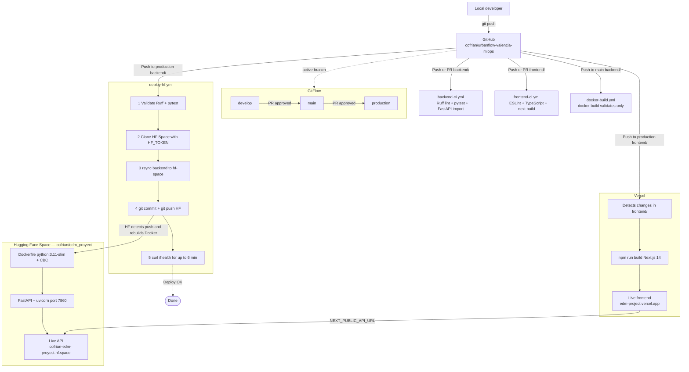

# UrbanFlow Valencia

> **Urban planning and optimization tool for the Valencia City Council**
> An end-to-end MLOps system: 24 CatBoost models in production, an integer-programming optimizer, real-time data integration, and automated deployment with drift monitoring.

**Graded 10/10** — EDM (*Model Evaluation, Deployment and Monitoring*), BSc in Data Science, Universitat Politècnica de València.

| | |
|---|---|
| **Live demo** | https://edm-project.vercel.app |
| **REST API** | https://cofrian-edm-proyect.hf.space |
| **API docs (Swagger)** | https://cofrian-edm-proyect.hf.space/docs |
| **API health** | https://cofrian-edm-proyect.hf.space/health |

**Stack:** Python · FastAPI · CatBoost · PuLP/CBC · Next.js 14 · TypeScript · Docker · GitHub Actions · Vercel · Hugging Face Spaces

---

## What is UrbanFlow Valencia?

A decision-support tool for Valencia City Council staff, built around two independent modules.

**Module A — Traffic prediction.**
Twenty-four CatBoost models (one per hour of the day, 0 to 23) predict traffic intensity across the city's 1,158 measurement zones. An operator can query any zone/hour/day combination to get the expected traffic level along with its reliability margin — useful for planning roadworks, security deployments or urban events.

**Module B — Facility optimization.**
An integer linear programming solver (PuLP + CBC) selects the locations for sports centres, health centres or Valenbisi bike stations that maximize population coverage under a real budget constraint. It runs independently of the prediction module: its inputs are real City Council candidate sites and H3 census data.

**Production monitoring.**
The monitoring module computes MAE per hour, raises alerts when it exceeds a configurable threshold, and flags zones with systematic error — letting the team detect model degradation without manual inspection.

The application also integrates real-time data from Valenbisi, EMT buses, City Council traffic status, and weather (AEMET / Open-Meteo).

---

## Why this project is worth a look

The interesting part is not the model — it's everything around it. The system implements the full CRISP-DM cycle, with emphasis on the phases that academic projects usually skip: deployment, automation and monitoring.

| CRISP-DM phase | Implementation |
|---|---|
| **Business understanding** | Tool for City Council staff: predict hourly traffic across 1,158 zones and optimize facility siting under budget |
| **Data understanding** | City Council data: October 2023 traffic, Valenbisi, EMT, AEMET, urban events |
| **Data preparation** | Cleaning, temporal alignment, 5-dimensional zone embeddings, cyclical features |
| **Modeling** | 24 hourly CatBoost models + historical baseline + sigmoid shrink weight |
| **Evaluation** | Strict temporal validation (days 25–31), MAE/RMSE/R²/sMAPE, per-zone and per-hour analysis |
| **Deployment** | FastAPI on Hugging Face + Next.js on Vercel + CI/CD with GitHub Actions |
| **Monitoring** | Per-hour MAE alerts, low-reliability zones, live system metrics |

A model doesn't end at evaluation: it has to ship as a service, publish itself automatically, and be observable in production. That's the cycle this repository implements.

---

## System architecture


> **Key point:** Vercel only serves HTML, CSS and JavaScript. All business logic (models, optimization, real-time data) lives in the Hugging Face backend. HTTP calls go from the user's browser to Hugging Face via CORS — not from Vercel.

---

## Functional modules

```mermaid
flowchart TD
    subgraph SOURCES["1 · Data sources"]
        F1["Historical — Valencia traffic oct2023 · Baseline · Validation metrics"]
        F2["Spatial — Zone GeoJSON · H3 hexagons · Candidates · Valenbisi · EMT"]
        F3["Real time — Valenbisi ArcGIS · EMT Valencia · ArcGIS traffic · AEMET / Open-Meteo"]
        F4["Urban events — Concerts · Matches · Fairs · Activities"]
    end

    subgraph BACKEND["2 · Backend engine · FastAPI"]
        B1["Traffic prediction — 24 hourly CatBoost models · Temporal and weather features"]
        B2["Urban optimization — PuLP + CBC solver · Sports · Health · Multi · Valenbisi"]
        B3["Mobility integration — TTL cache · Normalization · Weather fallback"]
        B4["Monitoring — MAE · RMSE · R2 · sMAPE · Reliability alerts · Zones to review"]
    end

    subgraph API["3 · REST API"]
        A1["/predict  /predict/heatmap  /predict/hour"]
        A2["/optimize/sports  /optimize/health  /optimize/multi  /optimize/valenbisi"]
        A3["/mobility/valenbisi  /mobility/emt/stops  /mobility/alerts"]
        A4["/map/zones  /metrics/by-hour  /monitoring/alerts  /weather/forecast"]
    end

    subgraph FRONTEND["4 · Frontend · Next.js"]
        W1["Prediction — Hourly traffic heatmap by zone"]
        W2["Optimization — Facility scenarios with coverage map"]
        W3["Evaluation — Model metrics and comparisons"]
        W4["Monitoring — Reliability alerts and system status"]
        W5["Data / Methodology — Sources and CRISP-DM documentation"]
    end

    SOURCES --> BACKEND --> API --> FRONTEND
```



---

## Module 1 — Traffic prediction (CatBoost)

**Algorithm:** 24 independent CatBoost models, one per hour of the day.

**Training data:** Valencia traffic, October 2023. Temporal validation: days 1–24 for training, days 25–31 for test (never seen during fitting).

**Model features:**

| Category | Variables |
|---|---|
| Temporal (cyclical) | `hora_sin`, `hora_cos`, `dia_mes_norm`, `wind_sin`, `wind_cos` |
| Zone | 5-dimensional per-zone embeddings (`z_emb1`…`z_emb5`) |
| Weather | `temp_c`, `hum_rel`, `pres_mb`, `vel_viento_ms`, `precip_lm2` |
| Lags | `temp_c_lag1`, `temp_c_lag3`, `pres_mb_lag1`, `pres_mb_lag3` |
| Categorical | `Zona`, `Dia_Semana`, `tipo_dia` |

**Prediction formula (hybrid approach):**

```
intensity = baseline(zone, weekday, hour) × exp(shrink_weight × CatBoost_residual)
shrink_weight = sigmoid((baseline − τ) / s)
```

The sigmoid weight pulls the prediction back toward the historical baseline when uncertainty is high (low-traffic zones or night hours), avoiding erratic predictions in conditions poorly represented in training.

**Test-set results (days 25–31, never used in training):**

| MAE | RMSE | R² | sMAPE |
|---|---|---|---|
| 44.4 veh/h | 87.8 | 0.92 | 16.8 % |

---

## Module 2 — Urban optimization (ILP)

Integer Linear Programming implemented with **PuLP** and the open-source **CBC (COIN-OR)** solver.

**General problem:**
```
Maximize:    Σⱼ population_j × Yⱼ        (population coverage)
Subject to:  Yⱼ ≤ Σᵢ αᵢⱼ × Xᵢ           (coverage given selected candidates)
             Σᵢ cost_i × Xᵢ ≤ budget
             Xᵢ, Yⱼ ∈ {0, 1}
```

Where `αᵢⱼ` is 1 if candidate `i` covers population hexagon `j`.

| Endpoint | Objective | Constraint |
|---|---|---|
| `POST /optimize/sports` | Max. population with sports coverage | Total budget |
| `POST /optimize/health` | Max. population with health coverage | Total budget |
| `POST /optimize/multi` | Balance sports + health (λ parameter) | Budget + no overlap |
| `POST /optimize/valenbisi` | Max. traffic + population + deficit | Fixed N stations |
| `POST /optimize/coverage` | Max. general population coverage | Total budget |

Typical solve time: **5 to 30 seconds**.

---

## Module 3 — Real-time mobility integration

| Source | Data | Cache TTL |
|---|---|---|
| **AEMET** (`opendata.aemet.es`) | Temperature, humidity, pressure, wind, precipitation | 600 s |
| **Open-Meteo** | Free weather fallback if AEMET is down | 600 s |
| **Valenbisi** (City Council ArcGIS) | Bikes and docks available per station | 180 s |
| **EMT Valencia** (SAE + GTFS) | Stops, real-time arrivals, bus routes | 45 s |
| **City Council ArcGIS** | Traffic status: free-flowing / dense / congested / closed | 60 s |

**Weather fallback chain:** AEMET → Open-Meteo → sinusoidal values estimated by hour of day.

**Automatically generated smart alerts:**
- Valenbisi station empty, full or closed
- Valenbisi station near an active event (radius < 1 km)
- EMT bus delayed by more than 3 minutes
- Estimated bus position computed from route and remaining time when SAE is unresponsive

---

## Module 4 — Model monitoring

The system compares each hour's MAE against a configurable threshold (default 80 veh/h).

- If an hour exceeds the threshold → low-reliability alert for that time slot
- Zones with the largest systematic validation error are identified
- System status is exposed: CPU, memory and Docker container uptime

**Endpoints:** `GET /monitoring/alerts` · `GET /monitoring/zones-to-review` · `GET /monitoring/system`

---

## Deep dive — model design

This section covers the reasoning behind the two main models: the CatBoost traffic prediction system and the ILP urban optimizer.

### Why two independent modules

UrbanFlow deliberately separates prediction and optimization because they answer different questions on different time horizons.

The **prediction module** answers *"what will happen?"*: it estimates future traffic pressure for any zone and hour, providing context for operational decisions (security deployments, event management, incident anticipation).

The **optimization module** answers *"where should we act?"*: given a budget and a set of real candidate sites, it determines which locations maximize urban impact. It runs independently of the prediction module, and can optionally consume predicted traffic as a scoring variable.

This separation is a deliberate architectural decision: both modules can run autonomously, be updated separately, and be evaluated with their own metrics.

---

### Module A — CatBoost traffic prediction: detailed design

#### The problem

Valencia records traffic intensity across more than 1,000 measurement zones. Traffic behaviour is not uniform: the dynamics of 8am on a Monday have nothing to do with 2pm on a Saturday or the small hours of a public holiday.

The module's goal is to predict, for any combination of zone + hour + day + weather conditions, how many vehicles per hour to expect.

#### A 24-model architecture

Instead of training a single model to handle every hour, UrbanFlow trains **24 independent CatBoost models** — one per hour of the day.

This buys three concrete advantages:

1. **Distinct hourly patterns are captured.** The 8am model learns the relationships that drive morning traffic (day type, temperature, atmospheric pressure). The 11pm model learns entirely different ones. A single model would have to approximate all of them at once, losing accuracy across every time slot.

2. **Failure independence.** If one hour's model fails or degrades, the others are unaffected. Monitoring can detect degradation slot by slot.

3. **Selective retraining.** If traffic conditions change in one time slot (say, new night-mobility policies), only that hour's model needs retraining — not all 24.

Models are stored as `.cbm` artifacts (CatBoost's native format) under `backend/models/`, versioned with **Git LFS** since they're heavy binaries unsuited to standard version control.

#### Training data and temporal validation

The primary dataset comes from **Valencia City Council**: over 850,000 hourly traffic intensity records from **October 2023**, covering the city's 1,158 measurement zones.

Validation follows a **strict temporal** scheme:

- **Training:** 1–24 October 2023
- **Validation:** 25–31 October 2023 (never seen during fitting)

This split is critical for time series. A random partition would leak information: the model would learn patterns from the future during training and its evaluation metrics would be artificially optimistic. The temporal partition ensures the metrics reflect real generalization to future days.

#### Residual approach with a historical baseline

The model doesn't predict traffic intensity directly from scratch. It uses a **two-layer residual approach**:

**Layer 1 — Historical baseline.**
For each `(zone, weekday, hour)` combination, the mean historical intensity is computed from the training set. This baseline captures each zone's "expected" behaviour under normal conditions.

**Layer 2 — CatBoost correction.**
CatBoost doesn't predict absolute intensity but the **residual** against the baseline: how far the current situation deviates from what's historically typical, given weather context, day type and other factors.

The final prediction combines both layers through a **sigmoid weighting function** (shrink weight):

```
final_intensity = baseline × exp(shrink_weight × CatBoost_residual)

shrink_weight = sigmoid((baseline − τ) / s)
```

Where `τ` is a traffic threshold and `s` a scale parameter.

The effect of this function is central to the system's robustness:

- When the baseline is **high** (busy zone, rush hour): the sigmoid weight approaches 1 and CatBoost has strong influence. There's enough historical evidence to trust the correction.
- When the baseline is **low** (quiet zone, small hours, holiday): the weight drops and the prediction moves progressively toward the baseline. In zones or slots thinly represented in the data, the model could produce erratic corrections; the shrink weight damps them.

This mechanism prevents overfitting in infrequent conditions without hand-written fallback rules.

#### Model features

| Category | Variables | Description |
|---|---|---|
| **Cyclical temporal** | `hora_sin`, `hora_cos` | Circular hour encoding (avoids the 23h→0h discontinuity) |
| **Temporal** | `dia_mes_norm`, `wind_sin`, `wind_cos` | Normalized day of month and encoded wind direction |
| **Day type** | `Dia_Semana`, `tipo_dia` | Weekday / weekend / holiday |
| **Zone** | `z_emb1` … `z_emb5` | 5-dimensional learned per-zone embeddings (1,158 zones → dense representation) |
| **Current weather** | `temp_c`, `hum_rel`, `pres_mb`, `vel_viento_ms`, `precip_lm2` | AEMET variables for the target hour |
| **Weather lags** | `temp_c_lag1`, `temp_c_lag3`, `pres_mb_lag1`, `pres_mb_lag3` | Temperature and pressure at 1h and 3h lag |

The **zone embeddings** deserve a special mention. Rather than treating the zone as a categorical variable with 1,158 independent levels (which would create sparsity and hinder generalization), a dense 5-dimensional representation is learned per zone. Zones with similar traffic behaviour end up with nearby embeddings in vector space, letting the model generalize across zones with similar patterns even when individual history is thin.

#### Evaluation metrics (days 25–31, unseen in training)

| Metric | Value | Interpretation |
|---|---|---|
| **MAE** | 44.4 veh/h | Mean absolute error. The model is off by ~44 vehicles/hour on average |
| **RMSE** | 87.8 veh/h | Penalizes large errors. Large one-off errors are moderate |
| **R²** | 0.92 | The model explains 92 % of the variance observed in the test data |
| **sMAPE** | 16.8 % | Symmetric percentage error. Useful for comparing zones with different base volumes |

Beyond global metrics, the app shows **error per time slot** — a model can have a good average MAE and still fail systematically at specific hours (e.g. the evening rush). That granularity is what lets monitoring detect real degradation before it affects decisions.

#### Output: urban pressure heatmap

Each hour's prediction is turned into an **urban pressure heatmap** with three levels:

- **Low:** predicted intensity in the zone's lower historical range
- **Medium:** normal or slightly elevated intensity
- **High:** intensity above the zone's reference percentile

Classification is relative to the zone itself: a structurally busy zone may show "low pressure" on a Sunday, while a quiet zone may show "high pressure" during an event. This makes the heatmap more operationally useful than an absolute vehicles/hour scale.

Users can change the date, hour and event scenario to see predicted pressure under any combination of conditions.

---

### Module B — ILP urban optimization: detailed design

#### The problem

Given a set of **real candidate locations** (sports centres, health centres, potential new Valenbisi stations) and a **maximum budget**, which combination of actions maximizes benefit to the city?

The answer isn't trivial. Picking the candidates with the highest individual demand can be suboptimal if they cover the same population area. A mathematical optimization solver evaluates combinations systematically and finds the globally optimal assignment, not just a locally good one.

#### General mathematical formulation

The problem is formulated as **Integer Linear Programming (ILP)** and implemented with **PuLP** and the open-source **CBC (COIN-OR Branch-and-Cut)** solver.

Decision variables are binary:

```
Xᵢ ∈ {0, 1}   →  1 if candidate i is selected, 0 otherwise
Yⱼ ∈ {0, 1}   →  1 if population zone j is covered, 0 otherwise
```

The general population coverage problem:

```
Maximize:    Σⱼ population_j × Yⱼ

Subject to:
  Yⱼ ≤ Σᵢ αᵢⱼ × Xᵢ           ∀ j   (zone j is covered only if some candidate reaching it is selected)
  Σᵢ cost_i × Xᵢ ≤ budget            (budget constraint)
  Xᵢ, Yⱼ ∈ {0, 1}                    (binary variables)
```

Where `αᵢⱼ = 1` if candidate `i` covers population zone `j` within its influence radius, and `0` otherwise. This coverage matrix is precomputed once from the H3 geometry.

#### Spatial representation with H3 hexagons

Valencia is divided into **H3 hexagons** (Uber's geospatial indexing system) at a resolution balancing granularity against computational cost.

Each hexagon carries:
- **Population** estimated from census data
- **Service demand** (varying by mode: sports, health, mobility)
- **Existing coverage** (whether facilities already sit in its catchment)

For each candidate, the set of hexagons that would fall within its influence radius is precomputed. This candidate → covered-hexagons relation forms the **coverage matrix `αᵢⱼ`**.

Separating spatial representation (H3 hexagons) from optimization logic (ILP) makes it possible to update population or candidate data without touching the solver, and to tune the influence radius without reformulating the problem.

#### Optimization modes

Five modes, with formulations adapted to each objective:

**Sports mode (`/optimize/sports`)**
Maximizes the population that would gain sports coverage from new facilities, avoiding redundancy with existing centres. Existing coverage is modelled by excluding already-covered hexagons from the target set `Yⱼ`.

**Health mode (`/optimize/health`)**
Structurally identical to sports mode but over the health-centre network. Prioritizes densely populated zones without nearby health coverage.

**Multi-objective mode (`/optimize/multi`)**
Combines sports and health coverage in a single problem with a configurable **lambda parameter**:

```
Maximize: λ × sports_coverage + (1 − λ) × health_coverage

Additional constraint:
  Xᵢ_sports + Xᵢ_health ≤ 1   ∀ i   (don't install two services on the same candidate site)
```

With `λ = 1` the solution is purely sports-oriented; with `λ = 0`, purely health-oriented; with `λ = 0.5` it balances both. This lets the decision-maker tune priorities without changing the model.

**Valenbisi mode (`/optimize/valenbisi`)**
Swaps the objective function from population coverage to a weighted **mobility score**:

```
score_i = wₜ × traffic_i + wₚ × population_i + w_d × deficit_i

Maximize: Σᵢ score_i × Xᵢ

Alternative constraint (count mode):  Σᵢ Xᵢ = N   (exactly N new stations)
Alternative constraint (budget mode): Σᵢ cost_i × Xᵢ ≤ budget
```

All three weights (`wₜ`, `wₚ`, `w_d`) are user-configurable in the UI, allowing prioritization of zones by traffic, population or station deficit depending on the planning criterion of the moment.

The **traffic** component can consume Module A's prediction: zones with high predicted traffic pressure score higher, which is what connects the two modules.

**General coverage mode (`/optimize/coverage`)**
Maximizes general population coverage without restricting to a specific facility type.

#### Why ILP and not heuristics

Selecting locations under a budget constraint is an instance of the **Set Cover problem**, NP-hard in general. At Valencia's scale (hundreds of candidates, thousands of hexagons), though, CBC solves it to optimality in **5 to 30 seconds**.

Heuristic alternatives (greedy, genetic algorithms, simulated annealing) are faster but don't guarantee the optimal solution. For a decision-support system intended for real planning meetings, the guarantee of mathematical optimality is an operational advantage: the decision-maker can trust that the system explored the solution space exhaustively rather than settling for a local approximation.

#### Optimizer output

The solver returns:
- Ordered list of selected candidates with coordinates, type, zone and individual cost
- Total budget used and percentage of the maximum
- Additional population covered (coverage modes) or total score (Valenbisi mode)
- The active mode and constraint

The UI plots selected candidates on the map alongside existing-coverage, traffic and current-station layers, so the recommendation can be checked visually before a decision is made.

---

### Module C — Real-time mobility integration: data logic

The mobility layer isn't just visualization: it cross-references sources to generate **smart alerts** the prediction module couldn't produce on its own.

#### Valenbisi integration

The system queries the live status of every Valenbisi station in Valencia (via the City Council's ArcGIS) and classifies each into four states: available, empty, full or closed.

It also cross-references each station's position against **active urban events**. If a problematic station (empty, full or closed) sits within 1 km of an active event, a `VALENBISI_NEAR_EVENT` alert fires. This alert cannot be derived from predicted traffic data alone: it requires the real-time spatial join between the Valenbisi network and the events calendar.

#### EMT integration

The EMT integration covers three layers:

1. **Stops:** geographic position and lines serving each stop
2. **Real-time arrivals:** estimated minutes to the next arrival per line (EMT SAE)
3. **Routes:** geographic line traces from GTFS data, with stops projected onto the real shape

When SAE returns no information for a line, the system computes an **estimated bus position** from the declared arrival time and the GTFS trace, marking it as "approximate position" on the map so it isn't mistaken for real GPS data.

If an arrival runs more than 3 minutes past its predicted time, an `EMT_DELAY` alert fires.

#### Weather fallback chain

Weather is a key feature of the prediction module. To guarantee data is always available:

1. **Primary source:** AEMET (`opendata.aemet.es`) with a configured API key
2. **Fallback 1:** Open-Meteo (free API, no authentication required)
3. **Fallback 2:** Sinusoidal values estimated by hour of day (typical temperature and humidity for Valencia given the time of year)

The fallback guarantees the prediction module always receives coherent weather features, even if both external APIs fail simultaneously.

#### Per-source TTL cache

Each external source has an independent cache TTL calibrated to how often the data actually changes:

| Source | TTL | Rationale |
|---|---|---|
| Valenbisi (ArcGIS) | 180 s | Docks change every few minutes |
| EMT SAE arrivals | 45 s | High rate of change; beyond 45 s the data is operationally useless |
| EMT routes (GTFS) | 6 hours | Routes don't change in the short term |
| ArcGIS traffic | 60 s | Traffic status can change within minutes |
| Weather (AEMET/Open-Meteo) | 600 s | Weather changes more slowly |

---

### Monitoring: closing the model loop

The monitoring module implements the final CRISP-DM phase: observing model behaviour in production and detecting degradation before it affects operational decisions.

#### What is monitored

- **MAE per time slot:** each model's MAE (hour 0 to 23) against a configurable threshold (default 80 veh/h). If an hour exceeds it, a low-reliability alert fires for that slot.
- **Zones with systematic error:** identification of measurement zones with the highest persistent validation MAE. These zones should be treated with caution in decision-making.
- **System status:** CPU, RAM and Docker container uptime, exposed live.

#### Why monitor MAE per hour and not just globally

A model can have an acceptable global MAE (say, 44 veh/h on average) while failing systematically in one slot (say, the 8am model at 120 veh/h). If that slot is the operationally critical one (morning rush), the global MAE is misleading.

Hour-level monitoring catches this kind of localized degradation and enables a selective response: retrain only the problematic model, leaving the other 23 untouched.

---

## Frontend — Application pages

| Route | Description |
|---|---|
| `/` | Project overview and module access |
| `/datos` | Dataset, variables and data preparation process |
| `/prediccion` | Hourly traffic heatmap + real-time mobility |
| `/evaluacion` | MAE, RMSE, R², sMAPE; error by hour and zone; actual vs predicted chart |
| `/optimizacion` | Facility scenarios with results map and population coverage |
| `/monitorizacion` | Reliability alerts, risk zones and system status |
| `/metodologia` | Methodology, CRISP-DM, data sources and technical documentation |

> The web UI is in Spanish — it was built for Valencia City Council staff as the end user.

---

## CI/CD — Continuous integration and deployment



### GitHub Actions workflows

| Workflow | Trigger | What it does |
|---|---|---|
| `backend-ci.yml` | Push or PR touching `backend/` | Ruff lint · 13 pytest tests · FastAPI import check |
| `frontend-ci.yml` | Push or PR touching `frontend/` | ESLint · TypeScript · next build |
| `docker-build.yml` | Push to `main` touching `backend/` | Docker build (validates packaging only, doesn't deploy) |
| `deploy-hf.yml` | Push to `production` touching `backend/` | Validate → rsync → push HF → health check |
| `deploy-check.yml` | Push to `production` | `curl /health` to confirm the API responds |

### Backend deployment flow (deploy-hf.yml)

1. Push to `production` with changes in `backend/`
2. **Validation:** Ruff + pytest. On failure, the deploy stops here.
3. **Sync:** clone the `cofrian/edm_proyect` Space with `HF_TOKEN`, copy `backend/` with `rsync` (excluding `.git`, `.env`, `__pycache__`) and `git push` to the HF repository.
4. **Rebuild:** Hugging Face detects the push and rebuilds the Docker image automatically (~2–5 min).
5. **Verification:** `curl /health` with retries for up to 6 minutes to confirm the API responds.

### Required GitHub secrets (Settings → Secrets → Actions)

| Secret | Purpose |
|---|---|
| `HF_TOKEN` | Hugging Face write token to push to the Space |
| `API_URL` | (optional) Backend URL for the post-deploy health check |

---

## Repository structure

```
urbanflow-valencia-mlops/
├── backend/                        # FastAPI API
│   ├── main.py                     # 50+ endpoints
│   ├── src/
│   │   ├── pipeline.py             # CatBoost inference (24 models)
│   │   ├── predict.py              # Per-zone prediction
│   │   ├── predict_batch.py        # All-zones heatmap
│   │   ├── optimize_facility.py    # ILP sports / health
│   │   ├── optimize_valenbisi.py   # ILP Valenbisi
│   │   ├── optimize_coverage.py    # ILP general coverage
│   │   ├── monitoring.py           # Alerts and metrics
│   │   ├── metrics.py              # MAE, RMSE, R², sMAPE
│   │   ├── ttl_cache.py            # In-memory TTL cache
│   │   └── integrations/
│   │       ├── aemet.py            # Weather (AEMET + Open-Meteo)
│   │       ├── mobility.py         # Valenbisi, EMT, ArcGIS traffic
│   │       └── valencia_traffic.py # Live ArcGIS traffic
│   ├── models/                     # 24 × .cbm + baseline + embeddings (Git LFS)
│   ├── data/processed/             # CSV, GeoJSON, JSON
│   ├── tests/                      # 13 pytest tests
│   └── Dockerfile                  # python:3.11-slim + CBC
│
├── frontend/                       # Next.js 14
│   ├── app/                        # 7 pages (App Router)
│   ├── components/                 # Leaflet maps, Recharts charts
│   └── lib/                        # api.ts · constants · types
│
├── docs/                           # Technical documentation (Spanish)
├── .github/workflows/              # 5 CI/CD workflows
├── docker-compose.yml              # Backend locally with Docker
└── .gitattributes                  # Git LFS (*.cbm, *.parquet)
```

---

## Running locally

### Requirements

- Python 3.11+
- Node.js 20+
- Git LFS installed (`git lfs install`) to clone the `.cbm` models
- CBC solver: `sudo apt install coinor-cbc` (Linux) / `brew install cbc` (macOS)

### Backend

```bash
cd backend
python -m venv .venv

# Windows
.venv\Scripts\activate

# Linux / macOS
source .venv/bin/activate

pip install -r requirements.txt
uvicorn main:app --reload --port 8000
```

- API: http://localhost:8000
- Swagger UI: http://localhost:8000/docs
- Health: http://localhost:8000/health

### Frontend

```bash
cd frontend
npm install
echo "NEXT_PUBLIC_API_URL=http://localhost:8000" > .env.local
npm run dev
```

- App: http://localhost:3000

### Docker (backend only)

```bash
docker compose up --build
# API at http://localhost:8000/health
```

### Tests and validation

```bash
# Backend
cd backend && pytest -q && ruff check .

# Frontend
cd frontend && npm run lint && npm run typecheck && npm run build

# Artifacts
python scripts/validate_artifacts.py
```

---

## Environment variables

### Backend (`backend/.env` or Hugging Face Settings → Variables)

| Variable | Required | Description | Example |
|---|---|---|---|
| `ENV` | Yes | Execution environment | `production` |
| `ALLOW_ORIGINS` | Yes | Allowed CORS origins (single line, comma-separated) | `http://localhost:3000,https://edm-project.vercel.app` |
| `DATA_DIR` | No | Path to processed data | `/app/data/processed` |
| `MODEL_DIR` | No | Path to CatBoost models | `/app/models` |
| `AEMET_API_KEY` | No | opendata.aemet.es API key. Without it, Open-Meteo is used | — |
| `MAE_ALERT_THRESHOLD` | No | MAE alert threshold in veh/h | `80` |
| `VALENCIA_VALENBISI_TTL_SECONDS` | No | Real-time Valenbisi cache | `180` |
| `VALENCIA_EMT_ARRIVALS_TTL_SECONDS` | No | EMT SAE arrivals cache | `45` |
| `VALENCIA_EMT_ROUTES_TTL_SECONDS` | No | EMT routes cache | `21600` |
| `VALENCIA_EMT_DELAY_THRESHOLD_MINUTES` | No | Delay threshold for EMT alerts | `3` |
| `VALENCIA_EVENT_VALENBISI_RADIUS_METERS` | No | Radius for Valenbisi-near-event alerts | `1000` |

> After changing variables or secrets on Hugging Face, run a **Factory rebuild** on the Space so they take effect.

### Frontend (`frontend/.env.local` or Vercel → Environment Variables)

| Variable | Description | Example |
|---|---|---|
| `NEXT_PUBLIC_API_URL` | Backend base URL | `https://cofrian-edm-proyect.hf.space` |

---

## Team workflow (GitFlow)

```
feature/*  ──PR──►  develop  ──merge──►  main  ──merge──►  production
 (work)             (integrate)          (stable)          (public demo)
```

| Branch | Purpose | Deploys to Vercel / HF |
|---|---|---|
| `feature/name` | Individual development | No |
| `develop` | Team continuous integration | No |
| `main` | Stable, validated version | CI only |
| `production` | Public demo | **Yes, both services** |

**`main` vs `production`:** on `main` the code is validated but doesn't reach users. On `production` the web and API are published. This allows changes to accumulate on `main` and deploy only when convenient.

### Which folder affects which service

| Folder | Service updated |
|---|---|
| `frontend/` | **Vercel** → https://edm-project.vercel.app |
| `backend/` | **Hugging Face** → https://cofrian-edm-proyect.hf.space |
| `docs/`, `README.md` | GitHub only, deploys nothing |

---

## Tech stack

| Layer | Technologies |
|---|---|
| **Frontend** | Next.js 14, React, TypeScript, TailwindCSS, Recharts, Leaflet |
| **Backend** | FastAPI, Pydantic, Uvicorn |
| **ML** | CatBoost 1.2.7, scikit-learn, Pandas, NumPy, PyArrow |
| **Optimization** | PuLP 2.9, CBC (COIN-OR Branch-and-Cut) |
| **Infrastructure** | Vercel (frontend), Hugging Face Spaces Docker (backend), GitHub Actions (CI/CD) |
| **Data** | Git LFS (`.cbm`, `.parquet`), CSV, GeoJSON, JSON |
| **Quality** | Ruff (Python linting), pytest (13 tests), ESLint, TypeScript strict |

---

## Additional documentation

Technical documentation lives in [`docs/`](docs/) and is written in Spanish:

| Document | Contents |
|---|---|
| [`docs/arquitectura.md`](docs/arquitectura.md) | Service diagram and design decisions |
| [`docs/modelo_predictivo.md`](docs/modelo_predictivo.md) | CatBoost, features, validation and detailed metrics |
| [`docs/despliegue.md`](docs/despliegue.md) | Vercel and Hugging Face operations guide |
| [`docs/metodologia_edm.md`](docs/metodologia_edm.md) | Full CRISP-DM × EDM syllabus map |
| [`docs/metodologia-equipo.md`](docs/metodologia-equipo.md) | GitFlow, merges, conflict resolution |

---

## Team

Built as a three-person team project for the EDM course at UPV:

- **Sergio Ortiz Montesinos** — [sortmon@etsinf.upv.es](mailto:sortmon@etsinf.upv.es)
- **Luis Trigueros Espada** — [ltriesp@etsinf.upv.es](mailto:ltriesp@etsinf.upv.es)
- **Fernando Martínez Gómez** — [fmargom1@etsinf.upv.es](mailto:fmargom1@etsinf.upv.es)

**My role (Sergio Ortiz):** lead developer across the full stack — system architecture, the CatBoost prediction pipeline, the ILP optimizer, the FastAPI backend, the Next.js frontend, and the CI/CD and deployment setup on Hugging Face and Vercel. Authored 137 of the repository's ~149 commits.

---

## License

MIT — see [`LICENSE`](LICENSE).
