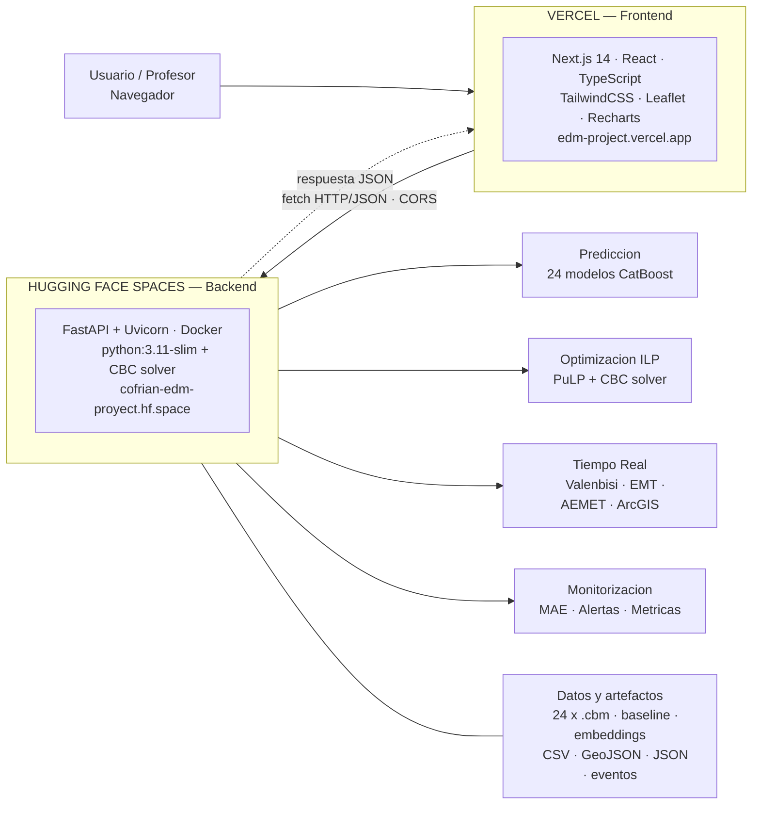
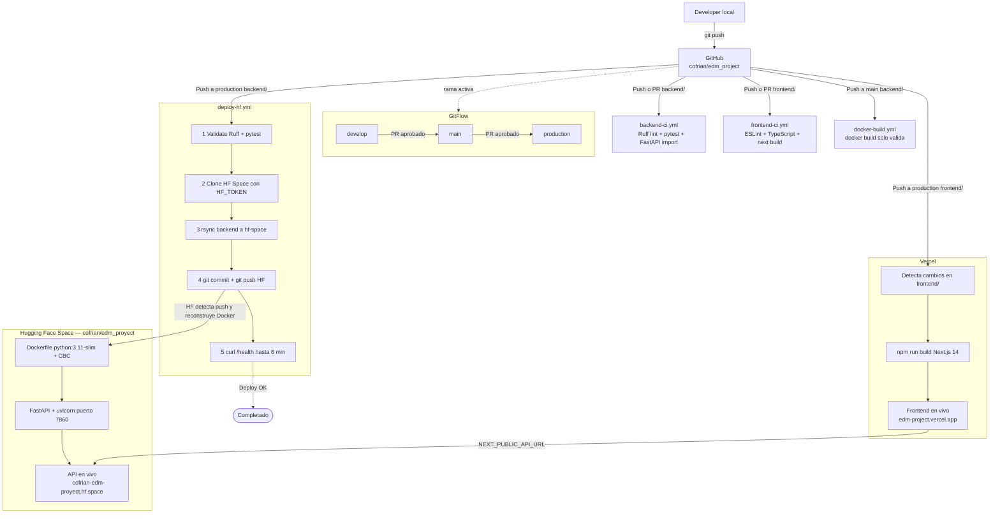

# UrbanFlow Valencia

> **Herramienta de planificación y optimización urbana para operarios del Ayuntamiento de Valencia**
> Proyecto de la asignatura **EDM — Evaluación, Despliegue y Monitorización de Modelos**
> Grado en Ciencia de Datos · Universitat Politècnica de València (UPV)

| | URL |
|---|---|
| **Demo web** | https://edm-project.vercel.app |
| **API REST** | https://cofrian-edm-proyect.hf.space |
| **Documentación API (Swagger)** | https://cofrian-edm-proyect.hf.space/docs |
| **Estado de la API** | https://cofrian-edm-proyect.hf.space/health |
| **Repositorio GitHub** | https://github.com/cofrian/edm_project |

---

## ¿Qué es UrbanFlow Valencia?

UrbanFlow Valencia es una **herramienta de apoyo a la decisión para operarios del Ayuntamiento de Valencia** con dos módulos independientes:

**Módulo A — Predicción de tráfico**
Veinticuatro modelos CatBoost (uno por hora del día, de 0 a 23) predicen la intensidad de tráfico en las 1.158 zonas de la ciudad. El operario puede consultar cualquier combinación de zona, hora y día para conocer el nivel de tráfico esperado con su margen de fiabilidad. Útil para planificar operaciones viarias, dispositivos de seguridad o eventos urbanos.

**Módulo B — Optimización de instalaciones**
Un solver de programación lineal entera (PuLP + CBC) selecciona las ubicaciones de polideportivos, centros de salud o estaciones Valenbisi que maximizan la cobertura de población bajo una restricción de presupuesto real. Opera de forma independiente al módulo de predicción: sus entradas son candidatos reales del Ayuntamiento y datos censales H3.

**Monitorización del modelo en producción**
El módulo de monitorización calcula el MAE por hora, lanza alertas cuando supera el umbral configurado y señala las zonas con error sistemático. Permite al equipo técnico detectar degradación del modelo sin intervención manual.

Además, la aplicación integra datos en tiempo real de Valenbisi, autobuses EMT, estado del tráfico del Ayuntamiento y meteorología (AEMET / Open-Meteo).

---

## Contexto académico — EDM y CRISP-DM

La asignatura EDM cubre el ciclo completo de vida de un modelo de machine learning desde el dato crudo hasta el sistema monitorizado en producción. El proyecto aplica el estándar **CRISP-DM** en todas sus fases, con especial énfasis en las que habitualmente se omiten en proyectos académicos: despliegue, automatización y monitorización.

| Fase CRISP-DM | Implementación en UrbanFlow Valencia |
|---|---|
| **Comprensión del negocio** | Herramienta para operarios del Ayuntamiento: predecir tráfico horario en 1.158 zonas y optimizar ubicación de equipamientos bajo presupuesto |
| **Comprensión de los datos** | Datos del Ayuntamiento: tráfico octubre 2023, Valenbisi, EMT, AEMET, eventos urbanos |
| **Preparación de los datos** | Limpieza, alineación temporal, embeddings de zona (5 dimensiones), features cíclicas |
| **Modelado** | 24 modelos CatBoost por hora + baseline histórico + shrink weight sigmoid |
| **Evaluación** | Validación temporal (días 25-31), MAE/RMSE/R²/sMAPE, análisis por zona y hora |
| **Despliegue** | FastAPI en Hugging Face + Next.js en Vercel + CI/CD con GitHub Actions |
| **Monitorización** | Alertas de MAE por hora, zonas de baja fiabilidad, métricas del sistema en tiempo real |

El énfasis diferencial de EDM está en que el modelo no termina con la evaluación: debe desplegarse como servicio, automatizarse su publicación y observarse su comportamiento en producción. UrbanFlow Valencia implementa este ciclo completo.

---

## Arquitectura del sistema



> **Punto clave:** Vercel solo sirve HTML, CSS y JavaScript. Toda la lógica de negocio (modelos, optimización, datos en tiempo real) vive en el backend de Hugging Face. Las llamadas HTTP salen desde el navegador del usuario hacia Hugging Face mediante CORS, no desde Vercel.

---

## Módulos funcionales

```mermaid
flowchart TD
    subgraph FUENTES["1 · Fuentes de datos"]
        F1["Historicos — Trafico Valencia oct2023 · Baseline · Metricas validacion"]
        F2["Espaciales — Zonas GeoJSON · Hexagonos H3 · Candidatos · Valenbisi · EMT"]
        F3["Tiempo real — Valenbisi ArcGIS · EMT Valencia · ArcGIS Trafico · AEMET / Open-Meteo"]
        F4["Eventos urbanos — Conciertos · Partidos · Ferias · Actividades"]
    end

    subgraph BACKEND["2 · Motor backend · FastAPI"]
        B1["Prediccion de trafico — 24 modelos CatBoost por hora · Features temporales y meteo"]
        B2["Optimizacion urbana — PuLP + CBC solver · Deportes · Salud · Multi · Valenbisi"]
        B3["Integracion de movilidad — Cache TTL · Normalizacion · Fallback meteorologico"]
        B4["Monitorizacion — MAE · RMSE · R2 · sMAPE · Alertas fiabilidad · Zonas a revisar"]
    end

    subgraph API["3 · API REST"]
        A1["/predict  /predict/heatmap  /predict/hour"]
        A2["/optimize/sports  /optimize/health  /optimize/multi  /optimize/valenbisi"]
        A3["/mobility/valenbisi  /mobility/emt/stops  /mobility/alerts"]
        A4["/map/zones  /metrics/by-hour  /monitoring/alerts  /weather/forecast"]
    end

    subgraph FRONTEND["4 · Frontend · Next.js"]
        W1["Prediccion — Heatmap de trafico por hora y zona"]
        W2["Optimizacion — Escenarios de instalaciones con mapa de cobertura"]
        W3["Evaluacion — Metricas del modelo y comparativas"]
        W4["Monitorizacion — Alertas de fiabilidad y estado del sistema"]
        W5["Datos / Metodologia — Fuentes y documentacion CRISP-DM"]
    end

    FUENTES --> BACKEND --> API --> FRONTEND
```



---

## Módulo 1 — Predicción de tráfico (CatBoost)

**Algoritmo:** 24 modelos CatBoost independientes, uno por hora del día (hora 0 a hora 23).

**Datos de entrenamiento:** Tráfico de Valencia, octubre de 2023. Validación temporal: días 1-24 para entrenamiento, días 25-31 para prueba (nunca vistos durante el ajuste).

**Features del modelo:**

| Categoría | Variables |
|---|---|
| Temporales (cíclicas) | `hora_sin`, `hora_cos`, `dia_mes_norm`, `wind_sin`, `wind_cos` |
| Zona | Embeddings de 5 dimensiones por zona (`z_emb1`...`z_emb5`) |
| Meteorológicas | `temp_c`, `hum_rel`, `pres_mb`, `vel_viento_ms`, `precip_lm2` |
| Retardos | `temp_c_lag1`, `temp_c_lag3`, `pres_mb_lag1`, `pres_mb_lag3` |
| Categoriales | `Zona`, `Dia_Semana`, `tipo_dia` |

**Fórmula de predicción (enfoque híbrido):**

```
intensidad = baseline(zona, dia_semana, hora) × exp(shrink_weight × residual_CatBoost)
shrink_weight = sigmoid((baseline − τ) / s)
```

El peso sigmoid hace que la predicción regrese hacia el baseline histórico cuando la incertidumbre es alta (zonas con poco tráfico o horas nocturnas), evitando predicciones erróneas en condiciones poco representadas en el entrenamiento.

**Resultados sobre datos de prueba (días 25-31, nunca usados en entrenamiento):**

| MAE | RMSE | R² | sMAPE |
|---|---|---|---|
| 44,4 veh/h | 87,8 | 0,92 | 16,8 % |

---

## Módulo 2 — Optimización urbana (ILP)

Programación Lineal Entera implementada con **PuLP** y el solver de código abierto **CBC (COIN-OR)**.

**Problema general:**
```
Maximizar:   Σⱼ población_j × Yⱼ       (cobertura poblacional)
Sujeto a:    Yⱼ ≤ Σᵢ αᵢⱼ × Xᵢ         (cobertura según candidatos seleccionados)
             Σᵢ coste_i × Xᵢ ≤ presupuesto
             Xᵢ, Yⱼ ∈ {0, 1}
```

Donde `αᵢⱼ` es 1 si el candidato `i` cubre el hexágono H3 de población `j`.

| Endpoint | Objetivo | Restricción |
|---|---|---|
| `POST /optimize/sports` | Máx. población con cobertura deportiva | Presupuesto total |
| `POST /optimize/health` | Máx. población con cobertura sanitaria | Presupuesto total |
| `POST /optimize/multi` | Equilibrio deporte + salud (parámetro λ) | Presupuesto + sin solapamiento |
| `POST /optimize/valenbisi` | Máx. tráfico + población + déficit | N estaciones fijas |
| `POST /optimize/coverage` | Máx. cobertura poblacional general | Presupuesto total |

Tiempo de resolución típico: **5 a 30 segundos**.

---

## Módulo 3 — Integración de movilidad en tiempo real

| Fuente | Datos | Cache TTL |
|---|---|---|
| **AEMET** (`opendata.aemet.es`) | Temperatura, humedad, presión, viento, precipitación | 600 s |
| **Open-Meteo** | Fallback meteorológico gratuito si AEMET no responde | 600 s |
| **Valenbisi** (ArcGIS Ayuntamiento) | Bicicletas y anclajes disponibles por estación | 180 s |
| **EMT Valencia** (SAE + GTFS) | Paradas, llegadas en tiempo real, rutas de autobús | 45 s |
| **ArcGIS Ayuntamiento** | Estado del tráfico: fluido / denso / congestionado / cortado | 60 s |

**Cadena de fallback meteorológico:** AEMET → Open-Meteo → valores sinusoidales estimados por hora del día.

**Alertas inteligentes generadas automáticamente:**
- Estación Valenbisi vacía, llena o cerrada
- Estación Valenbisi próxima a un evento activo (radio < 1 km)
- Autobús EMT con retraso superior a 3 minutos
- Posición estimada del bus calculada por ruta y tiempo restante cuando el SAE no responde

---

## Módulo 4 — Monitorización del modelo

El sistema compara el MAE de cada hora frente a un umbral configurable (por defecto 80 veh/h).

- Si una hora supera el umbral → alerta de baja fiabilidad para esa franja horaria
- Se identifican las zonas con mayor error sistemático en validación
- Se expone el estado del sistema: CPU, memoria y uptime del contenedor Docker

**Endpoints:** `GET /monitoring/alerts` · `GET /monitoring/zones-to-review` · `GET /monitoring/system`

---

## Explicación técnica detallada de los modelos

Esta sección recoge la explicación completa de los dos modelos principales de UrbanFlow Valencia: el sistema de predicción de tráfico basado en CatBoost y el optimizador urbano basado en Programación Lineal Entera. Complementa los apartados anteriores con el razonamiento técnico detrás de cada decisión de diseño.

---

### Por qué dos módulos independientes

UrbanFlow separa deliberadamente predicción y optimización porque responden a preguntas distintas con horizontes temporales distintos.

El **módulo de predicción** responde a "¿qué ocurrirá?": estima la presión de tráfico futura en cualquier zona y hora, y sirve de contexto para la toma de decisiones operativa (planificación de dispositivos de seguridad, gestión de eventos, anticipación de incidencias).

El **módulo de optimización** responde a "¿dónde conviene actuar?": dado un presupuesto y un conjunto de candidatos reales, determina qué ubicaciones maximizan el impacto urbano. Opera de forma independiente al módulo de predicción y puede incorporar tráfico predicho como variable de puntuación.

Esta separación es una decisión de arquitectura consciente: ambos módulos pueden ejecutarse de forma autónoma, actualizarse por separado y evaluarse con métricas propias.

---

### Módulo A — Predicción de tráfico con CatBoost: diseño detallado

#### El problema que resuelve

Valencia registra la intensidad de tráfico en más de 1.000 zonas de medición distribuidas por toda la ciudad. El comportamiento del tráfico no es uniforme: las dinámicas de las 8 de la mañana de un lunes no tienen nada que ver con las 14:00 del sábado o con la madrugada de un festivo.

El objetivo del módulo es predecir, para cualquier combinación de zona + hora + día + condiciones meteorológicas, cuántos vehículos por hora se esperan.

#### Arquitectura de 24 modelos independientes

En lugar de entrenar un único modelo que gestione todas las horas del día, UrbanFlow entrena **24 modelos CatBoost independientes**, uno por cada hora del día (modelo hora 0, modelo hora 1, ..., modelo hora 23).

Esta decisión tiene tres ventajas concretas:

1. **Captura de patrones horarios distintos.** El modelo de las 8h aprende las relaciones entre variables que determinan el tráfico matutino (tipo de día, temperatura, presión atmosférica). El modelo de las 23h aprende relaciones completamente diferentes. Un único modelo tendría que aproximar todos estos patrones a la vez, con mayor pérdida de precisión en todas las franjas.

2. **Independencia de fallos.** Si un modelo de una hora concreta falla o se degrada, los demás no se ven afectados. La monitorización puede detectar degradación franja a franja.

3. **Reentrenamiento selectivo.** Si cambian las condiciones de tráfico en una franja horaria (por ejemplo, nuevas políticas de movilidad nocturna), solo es necesario reentrenar el modelo de esa hora, no los 24.

Los modelos se almacenan como artefactos `.cbm` (formato nativo de CatBoost) bajo `backend/models/`, versionados con **Git LFS** por ser archivos binarios pesados no aptos para el control de versiones estándar.

#### Datos de entrenamiento y validación temporal

El conjunto de datos principal proviene del **Ayuntamiento de Valencia**: más de 850.000 registros horarios de intensidad de tráfico de **octubre de 2023**, cubriendo las 1.158 zonas de medición de la ciudad.

La validación sigue un esquema **temporal estricto**:

- **Entrenamiento:** días 1 a 24 de octubre de 2023
- **Validación:** días 25 a 31 de octubre de 2023 (nunca vistos durante el ajuste)

Esta separación es crítica en series temporales. Una partición aleatoria provocaría fuga de información: el modelo aprendería patrones del futuro durante el entrenamiento y sus métricas de evaluación serían artificialmente optimistas. La partición temporal garantiza que las métricas reflejan la capacidad real de generalización a días futuros.

#### Enfoque residual con baseline histórico

El modelo no predice la intensidad de tráfico directamente desde cero. Utiliza un **enfoque residual en dos capas**:

**Capa 1 — Baseline histórico:**
Para cada combinación `(zona, día_semana, hora)`, se calcula la intensidad media histórica a partir del conjunto de entrenamiento. Este baseline captura el comportamiento "esperado" de cada zona en condiciones normales.

**Capa 2 — Corrección CatBoost:**
CatBoost no predice la intensidad absoluta, sino el **residuo** respecto al baseline: cuánto se desvía la situación actual de lo históricamente habitual, dado el contexto meteorológico, el tipo de día y otros factores.

La predicción final combina ambas capas mediante una **función de ponderación sigmoide** (shrink weight):

```
intensidad_final = baseline × exp(shrink_weight × residual_CatBoost)

shrink_weight = sigmoid((baseline − τ) / s)
```

Donde `τ` es un umbral de tráfico y `s` es un parámetro de escala.

El efecto de esta función es clave para la robustez del sistema:

- Cuando el baseline es **alto** (zona concurrida, hora punta): el peso sigmoid es cercano a 1 y el modelo CatBoost tiene mucha influencia. Hay suficiente evidencia histórica para confiar en la corrección del modelo.
- Cuando el baseline es **bajo** (zona poco transitada, madrugada, festivo): el peso sigmoid cae y la predicción se acerca progresivamente al baseline. En zonas o franjas con poca representación en los datos, el modelo podría generar correcciones erráticas; el shrink weight las amortigua.

Este mecanismo evita sobreajuste en condiciones infrecuentes sin necesidad de construir reglas explícitas de fallback.

#### Features del modelo

| Categoría | Variables | Descripción |
|---|---|---|
| **Temporales cíclicas** | `hora_sin`, `hora_cos` | Codificación circular de la hora (evita discontinuidad entre 23h y 0h) |
| **Temporales** | `dia_mes_norm`, `wind_sin`, `wind_cos` | Día del mes normalizado y dirección del viento codificada |
| **Tipo de día** | `Dia_Semana`, `tipo_dia` | Laboral / fin de semana / festivo |
| **Zona** | `z_emb1` ... `z_emb5` | Embeddings de 5 dimensiones aprendidos por zona (1.158 zonas → representación densa) |
| **Meteorología actual** | `temp_c`, `hum_rel`, `pres_mb`, `vel_viento_ms`, `precip_lm2` | Variables AEMET de la hora objetivo |
| **Retardos meteorológicos** | `temp_c_lag1`, `temp_c_lag3`, `pres_mb_lag1`, `pres_mb_lag3` | Temperatura y presión con 1h y 3h de retardo |

Los **embeddings de zona** merecen mención especial. En lugar de tratar la zona como una variable categórica con 1.158 categorías independientes (lo que generaría sparsidad y dificultaría la generalización), se aprende una representación densa de 5 dimensiones por zona. Zonas con comportamientos de tráfico similares terminan con embeddings próximos en el espacio vectorial, lo que permite al modelo generalizar entre zonas con patrones parecidos incluso si tienen poco historial individual.

#### Métricas de evaluación (días 25-31, no vistos en entrenamiento)

| Métrica | Valor | Interpretación |
|---|---|---|
| **MAE** | 44,4 veh/h | Error absoluto medio. El modelo se equivoca en promedio en 44 vehículos/hora |
| **RMSE** | 87,8 veh/h | Penaliza errores grandes. Errores puntuales grandes son moderados |
| **R²** | 0,92 | El modelo explica el 92 % de la varianza observada en los datos de prueba |
| **sMAPE** | 16,8 % | Error porcentual simétrico. Útil para comparar entre zonas con distinto volumen base |

Además de las métricas globales, la app muestra el **error por franja horaria**, ya que un modelo puede tener buen MAE promedio y fallar sistemáticamente en horas concretas (p. ej., hora punta de salida). Esta granularidad es lo que permite a la monitorización detectar degradación real antes de que afecte a la toma de decisiones.

#### Salida: heatmap de presión urbana

La predicción de cada hora se transforma en un **heatmap de presión urbana** con tres niveles:

- **Baja:** intensidad predicha en el rango inferior histórico de la zona
- **Media:** intensidad normal o ligeramente elevada
- **Alta:** intensidad por encima del percentil de referencia de la zona

La clasificación es relativa a la propia zona: una zona con tráfico estructuralmente alto puede mostrar "presión baja" un domingo, mientras que una zona tranquila puede mostrar "presión alta" durante un evento. Esto hace el heatmap operativamente más útil que una escala absoluta de vehículos/hora.

El usuario puede cambiar la fecha, la hora y el escenario de eventos para ver la presión prevista en cualquier combinación de condiciones.

---

### Módulo B — Optimización urbana con ILP: diseño detallado

#### El problema que resuelve

Dado un conjunto de **ubicaciones candidatas reales** (polideportivos, centros de salud, puntos potenciales para nuevas estaciones Valenbisi) y un **presupuesto máximo**, ¿qué combinación de actuaciones maximiza el beneficio para la ciudad?

La respuesta no es trivial. Elegir los candidatos con mayor demanda individual puede ser subóptimo si cubren la misma zona de población. Un solver de optimización matemática evalúa las combinaciones de forma sistemática y encuentra la asignación globalmente óptima, no solo localmente buena.

#### Formulación matemática general

El problema se formula como **Programación Lineal Entera (ILP)** e implementa con **PuLP** y el solver de código abierto **CBC (COIN-OR Branch-and-Cut)**.

Las variables de decisión son binarias:

```
Xᵢ ∈ {0, 1}   →  1 si se selecciona el candidato i, 0 si no
Yⱼ ∈ {0, 1}   →  1 si la zona de población j queda cubierta, 0 si no
```

El problema general de cobertura de población:

```
Maximizar:   Σⱼ población_j × Yⱼ

Sujeto a:
  Yⱼ ≤ Σᵢ αᵢⱼ × Xᵢ           ∀ j   (cobertura: zona j cubierta solo si algún candidato que la alcanza es seleccionado)
  Σᵢ coste_i × Xᵢ ≤ presupuesto       (restricción presupuestaria)
  Xᵢ, Yⱼ ∈ {0, 1}                    (variables binarias)
```

Donde `αᵢⱼ = 1` si el candidato `i` cubre la zona de población `j` según su radio de influencia, y `αᵢⱼ = 0` en caso contrario. Esta matriz de cobertura se precalcula una vez a partir de la geometría H3.

#### Representación espacial con hexágonos H3

La ciudad de Valencia se divide en **hexágonos H3** (sistema de indexación geoespacial de Uber) a una resolución que equilibra granularidad y coste computacional.

Cada hexágono tiene asociado:
- **Población** estimada a partir de datos censales
- **Demanda** de servicio (diferente según el modo: deportiva, sanitaria, movilidad)
- **Cobertura existente** (si ya hay instalaciones en su área de influencia)

Para cada candidato, se precalcula el conjunto de hexágonos que quedarían dentro de su radio de influencia si fuera seleccionado. Esta relación candidato → hexágonos cubiertos forma la **matriz de cobertura `αᵢⱼ`**.

Separar la representación espacial (hexágonos H3) de la lógica de optimización (ILP) permite actualizar los datos de población o de candidatos sin modificar el solver, y permite ajustar el radio de influencia sin reformular el problema.

#### Modos de optimización

La app implementa cinco modos con formulaciones adaptadas a cada objetivo:

**Modo polideportivo (`/optimize/sports`)**
Maximiza la población que tendría cobertura deportiva a partir de las nuevas instalaciones, evitando redundancia con los polideportivos ya existentes. La cobertura existente se modela excluyendo los hexágonos ya cubiertos del conjunto objetivo `Yⱼ`.

**Modo sanitario (`/optimize/health`)**
Idéntico en estructura al modo deportivo pero sobre la red de centros de salud. Prioriza zonas con mayor densidad de población sin cobertura sanitaria cercana.

**Modo multiobjetivo (`/optimize/multi`)**
Combina cobertura deportiva y sanitaria en un único problema con un **parámetro lambda** configurable:

```
Maximizar: λ × cobertura_deportiva + (1 − λ) × cobertura_sanitaria

Restricción adicional:
  Xᵢ_deporte + Xᵢ_salud ≤ 1   ∀ i   (no instalar dos servicios en el mismo candidato)
```

Con `λ = 1` la solución es puramente deportiva; con `λ = 0` puramente sanitaria; con `λ = 0.5` equilibra ambos objetivos. Esta formulación permite que el decisor ajuste las prioridades sin cambiar el modelo.

**Modo Valenbisi (`/optimize/valenbisi`)**
Cambia la función objetivo de cobertura poblacional a una **puntuación de movilidad** ponderada:

```
puntuación_i = wₜ × tráfico_i + wₚ × población_i + w_d × déficit_i

Maximizar: Σᵢ puntuación_i × Xᵢ

Restricción alternativa (modo count): Σᵢ Xᵢ = N   (exactamente N estaciones nuevas)
Restricción alternativa (modo budget): Σᵢ coste_i × Xᵢ ≤ presupuesto
```

Los tres pesos (`wₜ`, `wₚ`, `w_d`) son configurables por el usuario en la interfaz, lo que permite priorizar zonas con más tráfico, más población o mayor déficit de estaciones según el criterio de planificación de cada momento.

El componente de **tráfico** puede incorporar la predicción del módulo A: zonas con alta presión de tráfico predicho reciben mayor puntuación, lo que conecta ambos módulos.

**Modo cobertura general (`/optimize/coverage`)**
Maximiza la cobertura poblacional general sin restringirse a un tipo de instalación concreto.

#### Por qué ILP y no heurísticas

El problema de selección de ubicaciones bajo restricción de presupuesto es un caso del **problema de cobertura de conjuntos** (Set Cover), que es NP-hard en general. Sin embargo, en la escala de Valencia (cientos de candidatos, miles de hexágonos) el solver CBC resuelve el problema a optimalidad en **5 a 30 segundos**.

Las alternativas heurísticas (greedy, algoritmos genéticos, simulated annealing) son más rápidas pero no garantizan la solución óptima. Para un sistema de apoyo a la decisión que va a usarse en reuniones de planificación real, la garantía de optimalidad matemática es una ventaja operativa: el decisor puede confiar en que el sistema ha explorado el espacio de soluciones de forma exhaustiva, no solo una aproximación local.

#### Salida del optimizador

El solver devuelve:
- Lista ordenada de candidatos seleccionados con coordenadas, tipo, zona y coste individual
- Presupuesto total utilizado y porcentaje respecto al máximo
- Población adicional cubierta (modos con cobertura) o puntuación total (modo Valenbisi)
- Indicación del modo y la restricción activa

La interfaz visualiza los candidatos seleccionados sobre el mapa junto con las capas de cobertura existente, tráfico y estaciones actuales, permitiendo contrastar visualmente la recomendación antes de tomar una decisión.

---

### Módulo C — Integración de movilidad en tiempo real: lógica de datos

La capa de movilidad no es solo visualización: incorpora lógica de cruce entre fuentes para generar **alertas inteligentes** que el módulo de predicción no puede generar por sí solo.

#### Integración Valenbisi

El sistema consulta el estado de todas las estaciones Valenbisi de Valencia en tiempo real (vía ArcGIS del Ayuntamiento) y clasifica cada estación en cuatro estados: disponible, vacía, llena o cerrada.

Adicionalmente, el sistema cruza la posición de cada estación con los **eventos urbanos activos**. Si una estación problemática (vacía, llena o cerrada) se encuentra a menos de 1 km de un evento activo, se genera una alerta de tipo `VALENBISI_NEAR_EVENT`. Esta alerta no puede generarse a partir de los datos de tráfico predicho: requiere el cruce espacial en tiempo real entre la red de Valenbisi y el calendario de eventos.

#### Integración EMT

La integración con la EMT cubre tres capas:

1. **Paradas:** posición geográfica y líneas que sirven cada parada
2. **Llegadas en tiempo real:** minutos estimados hasta la próxima llegada de cada línea (SAE EMT)
3. **Rutas:** trazado geográfico de las líneas a partir de datos GTFS, con proyección de paradas sobre el shape real

Cuando el SAE no devuelve información de una línea, el sistema calcula una **posición estimada del autobús** a partir del tiempo de llegada declarado y el trazado GTFS, marcándola como "posición aproximada" en el mapa para no confundirla con datos GPS reales.

Si una llegada supera en más de 3 minutos su tiempo previsto, el sistema genera una alerta `EMT_DELAY`.

#### Cadena de fallback meteorológico

La meteorología es una feature clave del módulo de predicción. Para garantizar que siempre haya datos disponibles:

1. **Fuente primaria:** AEMET (`opendata.aemet.es`) con API key configurada
2. **Fallback 1:** Open-Meteo (API gratuita, no requiere autenticación)
3. **Fallback 2:** Valores sinusoidales estimados por hora del día (temperatura y humedad típicas para Valencia según la época del año)

El fallback garantiza que el módulo de predicción siempre recibe features meteorológicas coherentes, incluso si ambas APIs externas fallan simultáneamente.

#### Cache TTL por fuente

Cada fuente externa tiene un TTL de caché independiente calibrado según la frecuencia real de actualización de los datos:

| Fuente | TTL | Justificación |
|---|---|---|
| Valenbisi (ArcGIS) | 180 s | Los anclajes cambian cada pocos minutos |
| Llegadas SAE EMT | 45 s | Alta frecuencia de cambio; más de 45 s hace el dato inútil operativamente |
| Rutas EMT (GTFS) | 6 horas | Las rutas no cambian en el corto plazo |
| Tráfico ArcGIS | 60 s | El estado del tráfico puede cambiar en minutos |
| Meteorología (AEMET/Open-Meteo) | 600 s | La meteorología cambia más lentamente |

---

### Monitorización: cerrar el ciclo del modelo

El módulo de monitorización implementa la fase final del ciclo CRISP-DM: observar el comportamiento del modelo en producción y detectar degradación antes de que afecte a las decisiones operativas.

#### Qué se monitoriza

- **MAE por franja horaria:** comparación entre el MAE de cada modelo (hora 0 a hora 23) y un umbral configurable (por defecto 80 veh/h). Si una hora supera el umbral, se genera una alerta de baja fiabilidad para esa franja.
- **Zonas con error sistemático:** identificación de las zonas de medición con mayor MAE persistente en validación. Estas zonas deben tratarse con cautela en la toma de decisiones.
- **Estado del sistema:** CPU, memoria RAM y uptime del contenedor Docker, expuesto en tiempo real.

#### Por qué monitorizar el MAE por hora y no solo el MAE global

Un modelo puede tener un MAE global aceptable (p. ej., 44 veh/h promedio) y al mismo tiempo fallar de forma sistemática en una franja concreta (p. ej., el modelo de las 8h tiene un MAE de 120 veh/h). Si esa franja es la más relevante operativamente (hora punta matutina), el MAE global es engañoso.

La monitorización a nivel de hora permite detectar este tipo de degradación localizada y reaccionar de forma selectiva: reentrenar solo el modelo problemático sin tocar los 23 restantes.

---

## Frontend — Páginas de la aplicación

| Ruta | Descripción |
|---|---|
| `/` | Presentación del proyecto y acceso a módulos |
| `/datos` | Dataset, variables y proceso de preparación de datos |
| `/prediccion` | Heatmap de tráfico por hora + movilidad en tiempo real |
| `/evaluacion` | MAE, RMSE, R², sMAPE; errores por hora y zona; gráfico real vs predicho |
| `/optimizacion` | Escenarios de instalación con mapa de resultados y cobertura poblacional |
| `/monitorizacion` | Alertas de fiabilidad, zonas de riesgo y estado del sistema |
| `/metodologia` | Metodología, CRISP-DM, fuentes de datos y documentación técnica |

---

## CI/CD — Integración y despliegue continuos



### Workflows de GitHub Actions

| Workflow | Cuándo se ejecuta | Qué hace |
|---|---|---|
| `backend-ci.yml` | Push o PR con cambios en `backend/` | Ruff lint · pytest 13 tests · FastAPI import check |
| `frontend-ci.yml` | Push o PR con cambios en `frontend/` | ESLint · TypeScript · next build |
| `docker-build.yml` | Push a `main` con cambios en `backend/` | Docker build (solo valida el empaquetado, no despliega) |
| `deploy-hf.yml` | Push a `production` con cambios en `backend/` | Validate → rsync → push HF → health check |
| `deploy-check.yml` | Push a `production` | `curl /health` para confirmar que la API responde |

### Flujo de despliegue del backend (deploy-hf.yml)

1. Push a `production` con cambios en `backend/`
2. **Validación:** Ruff + pytest. Si falla, el despliegue se detiene aquí.
3. **Sincronización:** clona el Space `cofrian/edm_proyect` con `HF_TOKEN`, copia `backend/` con `rsync` (excluyendo `.git`, `.env`, `__pycache__`) y hace `git push` al repositorio de HF.
4. **Reconstrucción:** Hugging Face detecta el push y reconstruye el Docker automáticamente (~2-5 min).
5. **Verificación:** `curl /health` con reintentos hasta 6 minutos para confirmar que la API responde.

### Secretos necesarios en GitHub (Settings → Secrets → Actions)

| Secret | Uso |
|---|---|
| `HF_TOKEN` | Token Write de Hugging Face para hacer push al Space |
| `API_URL` | (opcional) URL del backend para el health check post-deploy |

---

## Estructura del repositorio

```
EDM-Proyecto/
├── backend/                        # API FastAPI
│   ├── main.py                     # 50+ endpoints
│   ├── src/
│   │   ├── pipeline.py             # Inferencia CatBoost (24 modelos)
│   │   ├── predict.py              # Predicción por zona
│   │   ├── predict_batch.py        # Heatmap de todas las zonas
│   │   ├── optimize_facility.py    # ILP deportes / salud
│   │   ├── optimize_valenbisi.py   # ILP Valenbisi
│   │   ├── optimize_coverage.py    # ILP cobertura general
│   │   ├── monitoring.py           # Alertas y métricas
│   │   ├── metrics.py              # MAE, RMSE, R², sMAPE
│   │   ├── ttl_cache.py            # Cache en memoria por TTL
│   │   └── integrations/
│   │       ├── aemet.py            # Meteorología (AEMET + Open-Meteo)
│   │       ├── mobility.py         # Valenbisi, EMT, ArcGIS tráfico
│   │       └── valencia_traffic.py # Tráfico live ArcGIS
│   ├── models/                     # 24 × .cbm + baseline + embeddings (Git LFS)
│   ├── data/processed/             # CSV, GeoJSON, JSON
│   ├── tests/                      # 13 tests pytest
│   └── Dockerfile                  # python:3.11-slim + CBC
│
├── frontend/                       # Next.js 14
│   ├── app/                        # 7 páginas (App Router)
│   ├── components/                 # Mapas Leaflet, gráficos Recharts
│   └── lib/                        # api.ts · constants · types
│
├── docs/                           # Documentación técnica EDM
│   ├── arquitectura.md
│   ├── despliegue.md
│   ├── modelo_predictivo.md
│   ├── metodologia_edm.md
│   ├── metodologia-equipo.md
│   └── demo_profesores.md
│
├── .github/workflows/              # 5 workflows CI/CD
├── docker-compose.yml              # Backend local con Docker
└── .gitattributes                  # Git LFS (*.cbm, *.parquet)
```

---

## Ejecución local

### Requisitos

- Python 3.11+
- Node.js 20+
- Git LFS instalado (`git lfs install`) para clonar los modelos `.cbm`
- CBC solver: `sudo apt install coinor-cbc` (Linux) / `brew install cbc` (macOS)

### Backend

```bash
cd backend
python -m venv .venv

# Windows
.venv\Scripts\activate

# Linux / macOS
source .venv/bin/activate

pip install -r requirements.txt
uvicorn main:app --reload --port 8000
```

- API: http://localhost:8000
- Swagger UI: http://localhost:8000/docs
- Health: http://localhost:8000/health

### Frontend

```bash
cd frontend
npm install
echo "NEXT_PUBLIC_API_URL=http://localhost:8000" > .env.local
npm run dev
```

- App: http://localhost:3000

### Docker (solo backend)

```bash
docker compose up --build
# API en http://localhost:8000/health
```

### Tests y validación

```bash
# Backend
cd backend && pytest -q && ruff check .

# Frontend
cd frontend && npm run lint && npm run typecheck && npm run build

# Artefactos
python scripts/validate_artifacts.py
```

---

## Variables de entorno

### Backend (`backend/.env` o Hugging Face Settings → Variables)

| Variable | Obligatoria | Descripción | Ejemplo |
|---|---|---|---|
| `ENV` | Sí | Entorno de ejecución | `production` |
| `ALLOW_ORIGINS` | Sí | Orígenes CORS permitidos (una sola línea, separados por coma) | `http://localhost:3000,https://edm-project.vercel.app` |
| `DATA_DIR` | No | Ruta a datos procesados | `/app/data/processed` |
| `MODEL_DIR` | No | Ruta a modelos CatBoost | `/app/models` |
| `AEMET_API_KEY` | No | API key de opendata.aemet.es. Sin ella usa Open-Meteo como fuente | — |
| `MAE_ALERT_THRESHOLD` | No | Umbral de alerta MAE en veh/h | `80` |
| `VALENCIA_VALENBISI_TTL_SECONDS` | No | Cache Valenbisi en tiempo real | `180` |
| `VALENCIA_EMT_ARRIVALS_TTL_SECONDS` | No | Cache llegadas SAE EMT | `45` |
| `VALENCIA_EMT_ROUTES_TTL_SECONDS` | No | Cache rutas EMT | `21600` |
| `VALENCIA_EMT_DELAY_THRESHOLD_MINUTES` | No | Umbral de retraso para alerta EMT | `3` |
| `VALENCIA_EVENT_VALENBISI_RADIUS_METERS` | No | Radio para alertas Valenbisi cerca de eventos | `1000` |

> Tras cambiar variables o secretos en Hugging Face, haz **Factory rebuild** en el Space para que se apliquen.

### Frontend (`frontend/.env.local` o Vercel → Environment Variables)

| Variable | Descripción | Ejemplo |
|---|---|---|
| `NEXT_PUBLIC_API_URL` | URL base del backend | `https://cofrian-edm-proyect.hf.space` |

---

## Flujo de trabajo del equipo (GitFlow)

```
feature/*  ──PR──►  develop  ──merge──►  main  ──merge──►  production
 (trabajo)           (integrar)           (estable)          (demo pública)
```

| Rama | Propósito | Despliega en Vercel / HF |
|---|---|---|
| `feature/nombre` | Desarrollo individual de cada miembro | No |
| `develop` | Integración continua del equipo | No |
| `main` | Versión estable y validada, lista para entregar | Solo CI |
| `production` | Demo pública y entrega EDM | **Sí, ambos servicios** |

**`main` vs `production`:** en `main` el código está validado pero no llega a los usuarios. En `production` se publica la web y la API. Esto permite acumular cambios en `main` y desplegar únicamente cuando convenga (por ejemplo, antes de la demo con el profesor).

### Publicar en producción

```bash
# Subir a main desde develop
git checkout main && git pull && git merge develop && git push

# Desplegar a producción
git checkout production && git pull && git merge main && git push
# El push a production dispara GitHub Actions → Vercel + Hugging Face
```

### Qué carpeta afecta a cada servicio

| Carpeta | Servicio que se actualiza |
|---|---|
| `frontend/` | **Vercel** → https://edm-project.vercel.app |
| `backend/` | **Hugging Face** → https://cofrian-edm-proyect.hf.space |
| `docs/`, `README.md` | Solo GitHub, no despliega ningún servicio |

Los colaboradores no necesitan cuenta en Vercel ni en Hugging Face: con permiso de escritura en GitHub es suficiente.

---

## Stack tecnológico

| Capa | Tecnologías |
|---|---|
| **Frontend** | Next.js 14, React, TypeScript, TailwindCSS, Recharts, Leaflet |
| **Backend** | FastAPI, Pydantic, Uvicorn |
| **ML** | CatBoost 1.2.7, scikit-learn, Pandas, NumPy, PyArrow |
| **Optimización** | PuLP 2.9, CBC (COIN-OR Branch-and-Cut) |
| **Infraestructura** | Vercel (frontend), Hugging Face Spaces Docker (backend), GitHub Actions (CI/CD) |
| **Datos** | Git LFS (`.cbm`, `.parquet`), CSV, GeoJSON, JSON |
| **Calidad** | Ruff (linting Python), pytest (13 tests), ESLint, TypeScript strict |

---

## Demo para evaluación (5 minutos)

Guion completo paso a paso: [`docs/demo_profesores.md`](docs/demo_profesores.md)

1. **Arquitectura** — diagrama de servicios y flujo de datos
2. **Datos** (`/datos`) — fuentes, variables y preparación
3. **Predicción en vivo** (`/prediccion`) — heatmap + movilidad tiempo real
4. **Evaluación** (`/evaluacion`) — métricas reales, errores por hora y zona
5. **Optimización** (`/optimizacion`) — Valenbisi y cobertura de instalaciones
6. **Monitorización** (`/monitorizacion`) — alertas de fiabilidad del modelo
7. **CI/CD** — GitFlow, GitHub Actions, despliegue Vercel + Hugging Face

---

## Documentación adicional

| Documento | Contenido |
|---|---|
| [`docs/arquitectura.md`](docs/arquitectura.md) | Diagrama de servicios y decisiones de diseño |
| [`docs/modelo_predictivo.md`](docs/modelo_predictivo.md) | CatBoost, features, validación y métricas detalladas |
| [`docs/despliegue.md`](docs/despliegue.md) | Guía operativa de Vercel y Hugging Face |
| [`docs/metodologia_edm.md`](docs/metodologia_edm.md) | Mapa completo CRISP-DM × temario EDM |
| [`docs/metodologia-equipo.md`](docs/metodologia-equipo.md) | GitFlow, merges, resolución de conflictos |
| [`docs/demo_profesores.md`](docs/demo_profesores.md) | Guion de demo para evaluación |

---

## Autores

- **Sergio Ortiz Montesinos** — [sortmon@etsinf.upv.es](mailto:sortmon@etsinf.upv.es)
- **Luis Trigueros Espada** — [ltriesp@etsinf.upv.es](mailto:ltriesp@etsinf.upv.es)
- **Fernando Martínez Gómez** — [fmargom1@etsinf.upv.es](mailto:fmargom1@etsinf.upv.es)

---

## Licencia

MIT — ver [`LICENSE`](LICENSE).
