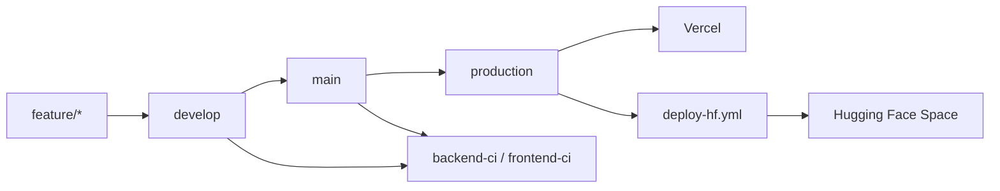

# Metodología de trabajo en equipo — UrbanFlow Valencia

Guía para **Sergio Ortiz Montesinos**, **Luis Trigueros Espada** y **Fernando Martínez Gómez** (y futuros colaboradores del repo `cofrian/urbanflow-valencia-mlops`).

Objetivo: que cualquier cambio pase por el mismo flujo **GitFlow + CI/CD** y llegue desplegado a **Vercel** (frontend) y **Hugging Face** (backend) sin pasos manuales.

---

## 1. Repositorios y despliegues

| Qué | Dónde | Quién despliega |
|-----|--------|-----------------|
| Código fuente (monorepo) | [github.com/cofrian/urbanflow-valencia-mlops](https://github.com/cofrian/urbanflow-valencia-mlops) | — |
| Frontend web | [edm-project.vercel.app](https://edm-project.vercel.app) | **Vercel** (integración GitHub) |
| API backend | [cofrian-edm-proyect.hf.space](https://cofrian-edm-proyect.hf.space) | **GitHub Actions** (`deploy-hf.yml`) |

No hace falta acceso a Vercel ni a Hugging Face para desarrollar: basta con permisos de escritura en el repo de GitHub.

---

## 2. Ramas y su significado

```
feature/*  →  develop  →  main  →  production
```

| Rama | Para qué sirve | ¿Despliega? |
|------|----------------|-------------|
| `feature/nombre` | Trabajo diario de cada persona | No |
| `develop` | Integración de features del equipo | No |
| `main` | Código estable, listo para publicar | No (solo CI) |
| `production` | Versión en la demo / entrega EDM | **Sí** (Vercel + HF) |

### Diferencia `main` vs `production`

- **`main`**: “está probado y mergeado”. Corre tests y builds, pero **no** actualiza la demo pública.
- **`production`**: “está publicado”. Cada push aquí dispara el despliegue real.

**Regla de oro:** no hacer commits directos en `main` ni en `production`. Siempre pasar por `feature/*` y Pull Request.

---

## 3. Flujo paso a paso (día a día)

### 3.1 Empezar un cambio

```bash
git clone https://github.com/cofrian/urbanflow-valencia-mlops.git
cd urbanflow-valencia-mlops
git checkout develop
git pull origin develop
git checkout -b feature/descripcion-corta
```

Nombre de rama recomendado:
- `feature/optimizacion-multi-ui`
- `fix/ci-ruff-imports`
- `docs/actualizar-readme`

### 3.2 Dónde editar según el cambio

| Si tocas… | Carpeta | Afecta a |
|-----------|---------|----------|
| Páginas, UI, mapas web | `frontend/` | Vercel |
| API, optimización, modelos | `backend/` | Hugging Face |
| Generar CSV/GeoJSON desde datos locales | `scripts/` | Backend (tras regenerar artefactos en `backend/data/processed/`) |
| Documentación EDM | `docs/` | Solo repo (no despliega) |
| Workflows CI/CD | `.github/workflows/` | Comportamiento del pipeline |

### 3.3 Probar en local antes de subir

**Backend:**
```bash
cd backend
pip install -r requirements.txt
sudo apt-get install coinor-cbc   # Linux; en Windows usar WSL o CBC instalado
pytest -q
ruff check .
uvicorn main:app --reload --port 8000
```

**Frontend:**
```bash
cd frontend
npm ci
npm run lint
npm run build
npm run dev
# http://localhost:3000  →  API local o HF según NEXT_PUBLIC_API_URL
```

### 3.4 Subir y abrir Pull Request

```bash
git add .
git commit -m "feat: descripcion clara del cambio"
git push -u origin feature/descripcion-corta
```

En GitHub:
1. **Compare & pull request** → base: **`develop`** (no `main`).
2. Rellenar la plantilla del PR (`.github/pull_request_template.md`).
3. Esperar a que **CI esté en verde**.

### 3.5 Merge y promoción a producción

1. **Merge del PR a `develop`** (cuando CI pase y alguien revise).
2. **Promover a `main`** (cuando el equipo acuerde que está listo):

```bash
git checkout main
git pull origin main
git merge develop
git push origin main
```

3. **Publicar en la demo** (despliegue real):

```bash
git checkout production
git pull origin production
git merge main
git push origin production
```

Tras el push a `production`:
- **Vercel** reconstruye el frontend (si hubo cambios en `frontend/`).
- **`deploy-hf.yml`** valida el backend y sincroniza `backend/` al Space de HF (si hubo cambios en `backend/` o en el workflow).
- **`deploy-check.yml`** comprueba `GET /health` de la API.

---

## 4. Qué dispara cada workflow (CI/CD)

| Workflow | Cuándo corre | Qué hace |
|----------|--------------|----------|
| `backend-ci.yml` | Push/PR con cambios en `backend/` | Ruff + pytest + import app |
| `frontend-ci.yml` | Push/PR con cambios en `frontend/` | ESLint + TypeScript + build |
| `docker-build.yml` | Push a `main` con cambios en `backend/` | Build imagen Docker |
| `deploy-hf.yml` | Push a `production` con cambios en `backend/` | Tests + sync a HF + health check |
| `deploy-check.yml` | Push a `production` | `curl` a la API |

Los colaboradores **no configuran secrets**. Los admins del repo mantienen:
- `HF_TOKEN` — token Write de Hugging Face (solo en GitHub Secrets).
- `API_URL` — (opcional) URL para smoke test.

---

## 5. Convenciones de commits

Usar prefijos claros:

| Prefijo | Uso |
|---------|-----|
| `feat:` | Nueva funcionalidad |
| `fix:` | Corrección de bug |
| `docs:` | Solo documentación |
| `ci:` | Cambios en pipelines |
| `chore:` | Tareas menores (versiones, limpieza) |
| `refactor:` | Reestructuración sin cambiar comportamiento |

Ejemplos:
```
feat: selector multi en pagina de optimizacion
fix: orden imports ruff en optimize_facility
docs: guia de contribucion para el equipo
```

---

## 6. Datos pesados y Git LFS

Los modelos CatBoost (`.cbm`) y algunos Parquet van con **Git LFS**. Antes del primer push con modelos:

```bash
git lfs install
git lfs pull
```

No subir:
- `.env` con secretos
- Carpetas locales `samsung/`, `CURSO SMARTCITIES/` (solo contexto local; los artefactos curados van en `backend/data/processed/`)
- Builds (`frontend/.next/`, `__pycache__/`)

---

## 7. Checklist antes de mergear un PR

- [ ] La rama sale de **`develop`**
- [ ] **CI en verde** (Backend CI y/o Frontend CI)
- [ ] Probado en local (al menos el módulo tocado)
- [ ] Sin secretos ni archivos generados innecesarios
- [ ] Si cambian artefactos de datos: regenerados con `scripts/` y commiteados en `backend/data/processed/`
- [ ] Documentación actualizada si el cambio afecta a la demo o a la API

---

## 8. Errores frecuentes

| Problema | Causa | Solución |
|----------|--------|----------|
| Backend CI rojo en “Lint” | Imports desordenados (Ruff) | `cd backend && ruff check --fix .` |
| Cambios no aparecen en la web | Solo mergeaste a `develop` | Promover `main` → `production` |
| API no se actualiza en HF | Push solo a `main` o sin tocar `backend/` | Merge a `production` con cambios en `backend/` |
| `deploy-hf` falla al inicio | Falta `HF_TOKEN` en secrets | Avisar al admin del repo |
| Modelos no cargan en CI | LFS no descargado | `git lfs pull` antes de commitear |

---

## 9. Roles recomendados

| Rol | Responsabilidad |
|-----|-----------------|
| **Colaborador** | Feature branch → PR a `develop`, CI verde |
| **Integrador** (cualquiera del equipo) | Merge a `develop`, promoción a `main` |
| **Release** (p. ej. Sergio) | Merge `main` → `production` cuando toque publicar la demo |

Opcional en GitHub: proteger `main` y `production` (Settings → Branches) para exigir PR y checks.

---

## 10. Diagrama resumen



---

## 11. Enlaces útiles

- Arquitectura: [`docs/arquitectura.md`](arquitectura.md)
- Despliegue y secrets: [`docs/despliegue.md`](despliegue.md)
- Metodología EDM (temario): [`docs/metodologia_edm.md`](metodologia_edm.md)
- Demo para profesores: [`docs/demo_profesores.md`](demo_profesores.md)
- API en vivo: https://cofrian-edm-proyect.hf.space/docs

---

*Última actualización: entrega EDM — UrbanFlow Valencia.*
